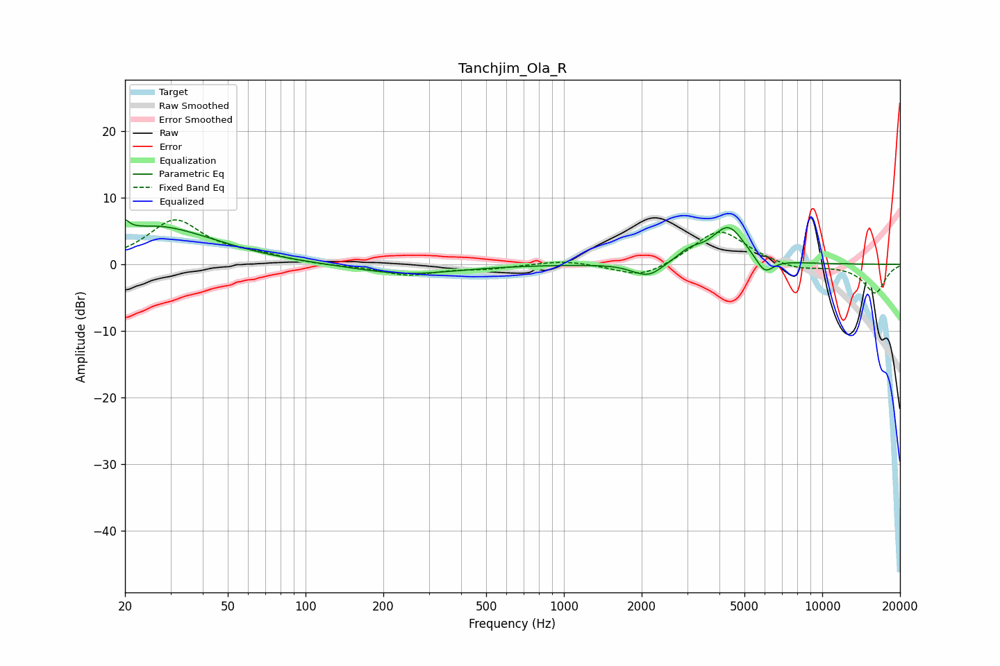

# Tanchjim_Ola_R
See [usage instructions](https://github.com/jaakkopasanen/AutoEq#usage) for more options and info.

### Parametric EQs
Apply preamp of -6.8 dB when using parametric equalizer.

|   # | Type    |   Fc (Hz) |    Q |   Gain (dB) |
|-----|---------|-----------|------|-------------|
|   1 | Peaking |        20 | 6    |         5.6 |
|   2 | Peaking |        20 | 6    |        -3.5 |
|   3 | Peaking |        25 | 1.16 |         1.2 |
|   4 | Peaking |        29 | 0.63 |         4.5 |
|   5 | Peaking |       244 | 0.73 |        -1.5 |
|   6 | Peaking |      1919 | 2.87 |        -0.5 |
|   7 | Peaking |      2157 | 2.72 |        -1.8 |
|   8 | Peaking |      3073 | 2.86 |         1.4 |
|   9 | Peaking |      4328 | 2.15 |         5.6 |
|  10 | Peaking |      5984 | 3.98 |        -2.5 |

### Fixed Band EQs
When using fixed band (also called graphic) equalizer, apply preamp of **-6.8 dB** (if available) and set gains manually with these parameters.

|   # | Type    |   Fc (Hz) |    Q |   Gain (dB) |
|-----|---------|-----------|------|-------------|
|   1 | Peaking |        31 | 1.41 |         6.5 |
|   2 | Peaking |        62 | 1.41 |         1.1 |
|   3 | Peaking |       125 | 1.41 |        -0.2 |
|   4 | Peaking |       250 | 1.41 |        -1.6 |
|   5 | Peaking |       500 | 1.41 |        -0.6 |
|   6 | Peaking |      1000 | 1.41 |         0.7 |
|   7 | Peaking |      2000 | 1.41 |        -2.2 |
|   8 | Peaking |      4000 | 1.41 |         5.4 |
|   9 | Peaking |      8000 | 1.41 |        -0.9 |
|  10 | Peaking |     16000 | 1.41 |        -4.3 |

### Graphs

