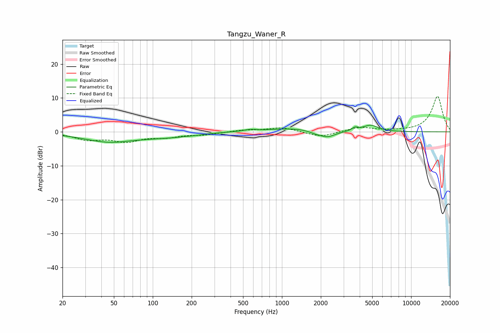

# Tangzu_Waner_R
See [usage instructions](https://github.com/jaakkopasanen/AutoEq#usage) for more options and info.

### Parametric EQs
Apply preamp of -2.1 dB when using parametric equalizer.

|   # | Type    |   Fc (Hz) |    Q |   Gain (dB) |
|-----|---------|-----------|------|-------------|
|   1 | Peaking |        49 | 0.66 |        -3.1 |
|   2 | Peaking |        62 | 1.7  |         0.3 |
|   3 | Peaking |       140 | 0.86 |        -1   |
|   4 | Peaking |       218 | 2.47 |        -0.2 |
|   5 | Peaking |       570 | 2.84 |         0.5 |
|   6 | Peaking |      1196 | 0.82 |         1   |
|   7 | Peaking |      1807 | 3.12 |        -0.5 |
|   8 | Peaking |      2240 | 2.27 |        -1.8 |
|   9 | Peaking |      3681 | 6    |         1   |
|  10 | Peaking |      4853 | 2.36 |         1.9 |

### Fixed Band EQs
When using fixed band (also called graphic) equalizer, apply preamp of **-10.6 dB** (if available) and set gains manually with these parameters.

|   # | Type    |   Fc (Hz) |    Q |   Gain (dB) |
|-----|---------|-----------|------|-------------|
|   1 | Peaking |        31 | 1.41 |        -2.1 |
|   2 | Peaking |        62 | 1.41 |        -2.5 |
|   3 | Peaking |       125 | 1.41 |        -1.3 |
|   4 | Peaking |       250 | 1.41 |        -0.8 |
|   5 | Peaking |       500 | 1.41 |         0.5 |
|   6 | Peaking |      1000 | 1.41 |         1.3 |
|   7 | Peaking |      2000 | 1.41 |        -1.6 |
|   8 | Peaking |      4000 | 1.41 |         1.4 |
|   9 | Peaking |      8000 | 1.41 |         0.1 |
|  10 | Peaking |     16000 | 1.41 |        10.5 |

### Graphs

