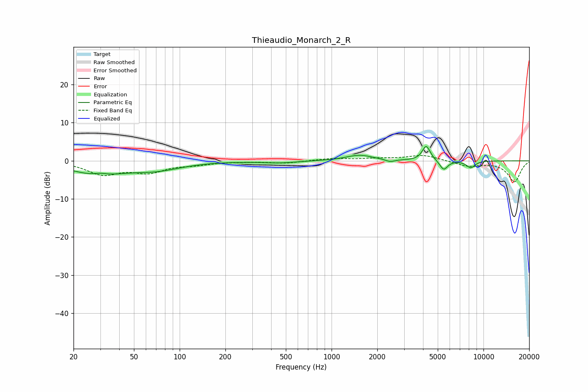

# Thieaudio_Monarch_2_R
See [usage instructions](https://github.com/jaakkopasanen/AutoEq#usage) for more options and info.

### Parametric EQs
Apply preamp of -3.9 dB when using parametric equalizer.

|   # | Type    |   Fc (Hz) |    Q |   Gain (dB) |
|-----|---------|-----------|------|-------------|
|   1 | Peaking |        29 | 0.81 |        -3.4 |
|   2 | Peaking |        30 | 3.21 |         0.6 |
|   3 | Peaking |        71 | 0.86 |        -2   |
|   4 | Peaking |       452 | 1.24 |        -0.5 |
|   5 | Peaking |      1526 | 1.59 |         1.5 |
|   6 | Peaking |      2426 | 4.85 |        -0.7 |
|   7 | Peaking |      4191 | 5.67 |         3.3 |
|   8 | Peaking |      4266 | 3.93 |         0.6 |
|   9 | Peaking |      5472 | 5.35 |        -2.5 |
|  10 | Peaking |      8244 | 4.61 |        -1.8 |

### Fixed Band EQs
When using fixed band (also called graphic) equalizer, apply preamp of **-1.5 dB** (if available) and set gains manually with these parameters.

|   # | Type    |   Fc (Hz) |    Q |   Gain (dB) |
|-----|---------|-----------|------|-------------|
|   1 | Peaking |        31 | 1.41 |        -3.4 |
|   2 | Peaking |        62 | 1.41 |        -2.7 |
|   3 | Peaking |       125 | 1.41 |        -0.8 |
|   4 | Peaking |       250 | 1.41 |        -0.1 |
|   5 | Peaking |       500 | 1.41 |        -0.6 |
|   6 | Peaking |      1000 | 1.41 |         0.6 |
|   7 | Peaking |      2000 | 1.41 |         0.5 |
|   8 | Peaking |      4000 | 1.41 |         1.5 |
|   9 | Peaking |      8000 | 1.41 |        -1.4 |
|  10 | Peaking |     16000 | 1.41 |        -5.5 |

### Graphs

