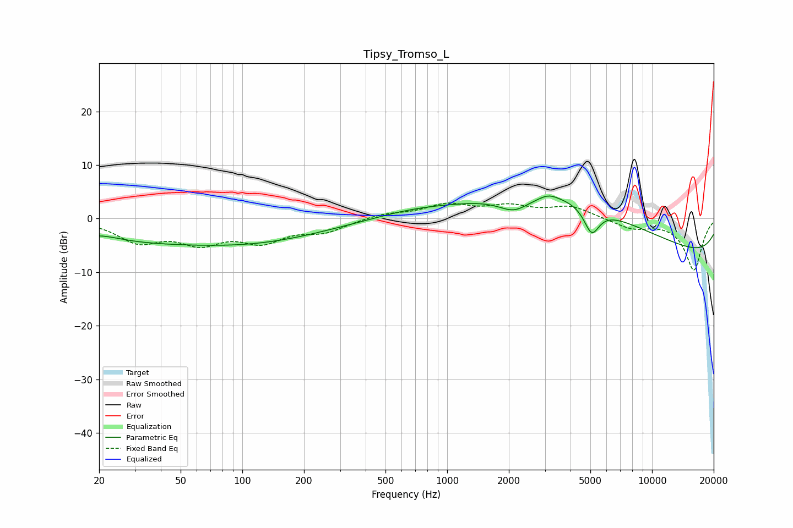

# Tipsy_Tromso_L
See [usage instructions](https://github.com/jaakkopasanen/AutoEq#usage) for more options and info.

### Parametric EQs
Apply preamp of -4.3 dB when using parametric equalizer.

|   # | Type    |   Fc (Hz) |    Q |   Gain (dB) |
|-----|---------|-----------|------|-------------|
|   1 | Peaking |        20 | 1.38 |         1.3 |
|   2 | Peaking |        25 | 0.2  |        -4.4 |
|   3 | Peaking |       147 | 0.45 |        -2.4 |
|   4 | Peaking |       648 | 0.79 |         0.8 |
|   5 | Peaking |      2120 | 1.85 |        -2.7 |
|   6 | Peaking |      3128 | 3.12 |         0.9 |
|   7 | Peaking |      3804 | 0.48 |         5.7 |
|   8 | Peaking |      4669 | 0.21 |         5.6 |
|   9 | Peaking |      5075 | 3.71 |        -5   |
|  10 | Peaking |     10000 | 0.18 |        -9.3 |

### Fixed Band EQs
When using fixed band (also called graphic) equalizer, apply preamp of **-3.0 dB** (if available) and set gains manually with these parameters.

|   # | Type    |   Fc (Hz) |    Q |   Gain (dB) |
|-----|---------|-----------|------|-------------|
|   1 | Peaking |        31 | 1.41 |        -4   |
|   2 | Peaking |        62 | 1.41 |        -3.9 |
|   3 | Peaking |       125 | 1.41 |        -3.8 |
|   4 | Peaking |       250 | 1.41 |        -2.2 |
|   5 | Peaking |       500 | 1.41 |         0.9 |
|   6 | Peaking |      1000 | 1.41 |         2.4 |
|   7 | Peaking |      2000 | 1.41 |         2   |
|   8 | Peaking |      4000 | 1.41 |         2.2 |
|   9 | Peaking |      8000 | 1.41 |        -1.7 |
|  10 | Peaking |     16000 | 1.41 |        -9.6 |

### Graphs

