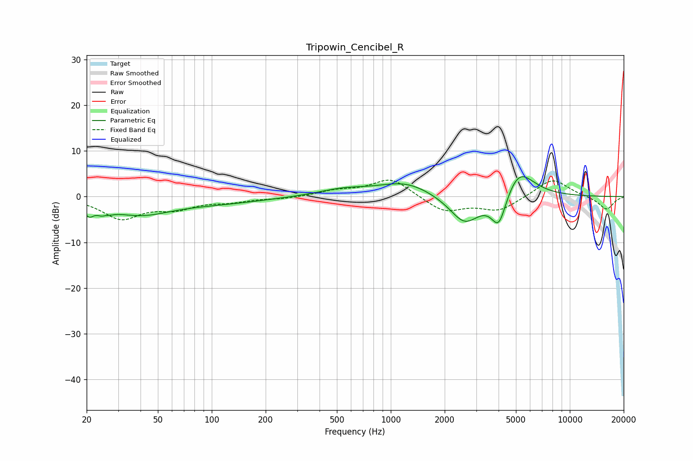

# Tripowin_Cencibel_R
See [usage instructions](https://github.com/jaakkopasanen/AutoEq#usage) for more options and info.

### Parametric EQs
Apply preamp of -4.5 dB when using parametric equalizer.

|   # | Type    |   Fc (Hz) |    Q |   Gain (dB) |
|-----|---------|-----------|------|-------------|
|   1 | Peaking |        21 | 5.59 |        -2.2 |
|   2 | Peaking |        25 | 4.87 |        -4.1 |
|   3 | Peaking |        25 | 5.98 |         2.8 |
|   4 | Peaking |        39 | 0.79 |        -3.7 |
|   5 | Peaking |       113 | 0.56 |        -1.2 |
|   6 | Peaking |       539 | 1    |         1.4 |
|   7 | Peaking |      1210 | 0.94 |         3.1 |
|   8 | Peaking |      2591 | 1.63 |        -6.4 |
|   9 | Peaking |      4016 | 3.21 |        -7.5 |
|  10 | Peaking |      5174 | 1.64 |         6.6 |

### Fixed Band EQs
When using fixed band (also called graphic) equalizer, apply preamp of **-3.7 dB** (if available) and set gains manually with these parameters.

|   # | Type    |   Fc (Hz) |    Q |   Gain (dB) |
|-----|---------|-----------|------|-------------|
|   1 | Peaking |        31 | 1.41 |        -4.6 |
|   2 | Peaking |        62 | 1.41 |        -2.2 |
|   3 | Peaking |       125 | 1.41 |        -0.9 |
|   4 | Peaking |       250 | 1.41 |        -0.4 |
|   5 | Peaking |       500 | 1.41 |         1.2 |
|   6 | Peaking |      1000 | 1.41 |         4.1 |
|   7 | Peaking |      2000 | 1.41 |        -3.4 |
|   8 | Peaking |      4000 | 1.41 |        -3   |
|   9 | Peaking |      8000 | 1.41 |         4.1 |
|  10 | Peaking |     16000 | 1.41 |        -2.9 |

### Graphs

