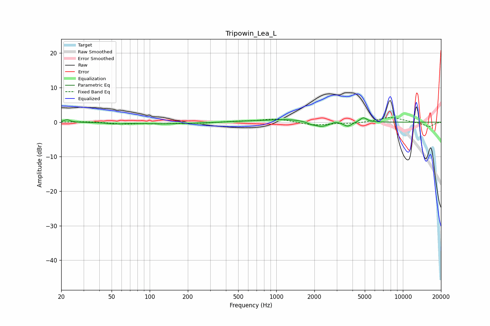

# Tripowin_Lea_L
See [usage instructions](https://github.com/jaakkopasanen/AutoEq#usage) for more options and info.

### Parametric EQs
Apply preamp of -1.3 dB when using parametric equalizer.

|   # | Type    |   Fc (Hz) |    Q |   Gain (dB) |
|-----|---------|-----------|------|-------------|
|   1 | Peaking |        22 | 5.97 |         0.7 |
|   2 | Peaking |        53 | 2.66 |        -0.3 |
|   3 | Peaking |       134 | 0.6  |        -0.5 |
|   4 | Peaking |       606 | 1.04 |         0.2 |
|   5 | Peaking |      1240 | 0.97 |         0.8 |
|   6 | Peaking |      1868 | 6    |        -0.4 |
|   7 | Peaking |      2259 | 2.35 |        -1.5 |
|   8 | Peaking |      2949 | 5.14 |         0.5 |
|   9 | Peaking |      3670 | 4.56 |        -1.2 |
|  10 | Peaking |      4871 | 5.03 |         1.4 |

### Fixed Band EQs
When using fixed band (also called graphic) equalizer, apply preamp of **-1.4 dB** (if available) and set gains manually with these parameters.

|   # | Type    |   Fc (Hz) |    Q |   Gain (dB) |
|-----|---------|-----------|------|-------------|
|   1 | Peaking |        31 | 1.41 |         0.2 |
|   2 | Peaking |        62 | 1.41 |        -0.5 |
|   3 | Peaking |       125 | 1.41 |        -0.4 |
|   4 | Peaking |       250 | 1.41 |        -0.3 |
|   5 | Peaking |       500 | 1.41 |         0.2 |
|   6 | Peaking |      1000 | 1.41 |         1   |
|   7 | Peaking |      2000 | 1.41 |        -0.9 |
|   8 | Peaking |      4000 | 1.41 |        -0.4 |
|   9 | Peaking |      8000 | 1.41 |         1.5 |
|  10 | Peaking |     16000 | 1.41 |        -1.3 |

### Graphs

