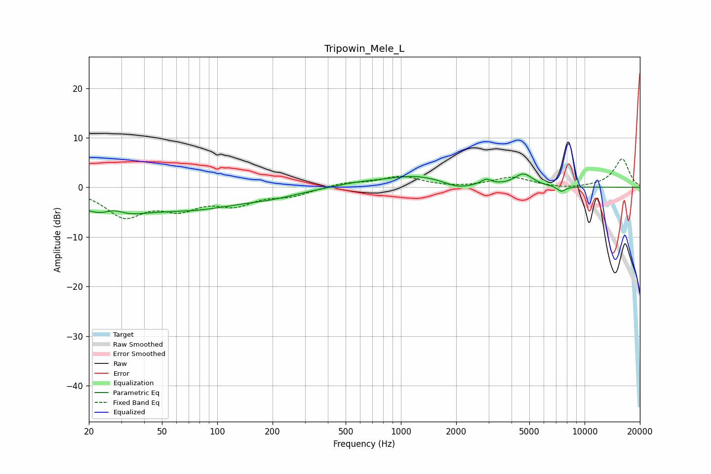

# Tripowin_Mele_L
See [usage instructions](https://github.com/jaakkopasanen/AutoEq#usage) for more options and info.

### Parametric EQs
Apply preamp of -2.8 dB when using parametric equalizer.

|   # | Type    |   Fc (Hz) |    Q |   Gain (dB) |
|-----|---------|-----------|------|-------------|
|   1 | Peaking |        26 | 0.86 |        -5.2 |
|   2 | Peaking |        27 | 2.51 |         1.8 |
|   3 | Peaking |        77 | 0.52 |        -3.7 |
|   4 | Peaking |       203 | 0.99 |        -0.9 |
|   5 | Peaking |       574 | 1.09 |         0.7 |
|   6 | Peaking |      1199 | 0.83 |         2.2 |
|   7 | Peaking |      2033 | 1.98 |        -1.1 |
|   8 | Peaking |      2917 | 4.98 |         1.1 |
|   9 | Peaking |      4653 | 2.81 |         2.5 |
|  10 | Peaking |      7475 | 6    |        -1.1 |

### Fixed Band EQs
When using fixed band (also called graphic) equalizer, apply preamp of **-5.8 dB** (if available) and set gains manually with these parameters.

|   # | Type    |   Fc (Hz) |    Q |   Gain (dB) |
|-----|---------|-----------|------|-------------|
|   1 | Peaking |        31 | 1.41 |        -5.5 |
|   2 | Peaking |        62 | 1.41 |        -3.6 |
|   3 | Peaking |       125 | 1.41 |        -3   |
|   4 | Peaking |       250 | 1.41 |        -1.5 |
|   5 | Peaking |       500 | 1.41 |         0.9 |
|   6 | Peaking |      1000 | 1.41 |         2.1 |
|   7 | Peaking |      2000 | 1.41 |        -0.2 |
|   8 | Peaking |      4000 | 1.41 |         2   |
|   9 | Peaking |      8000 | 1.41 |        -0.4 |
|  10 | Peaking |     16000 | 1.41 |         5.8 |

### Graphs

