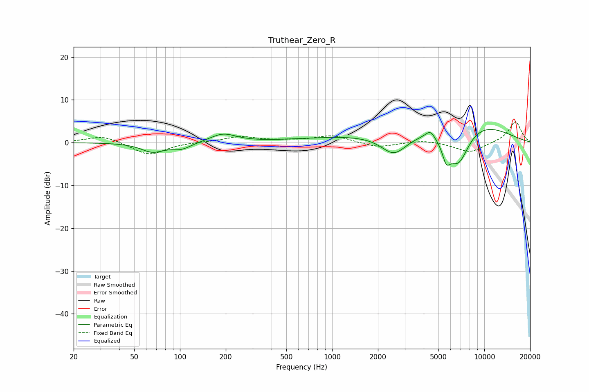

# Truthear_Zero_R
See [usage instructions](https://github.com/jaakkopasanen/AutoEq#usage) for more options and info.

### Parametric EQs
Apply preamp of -3.2 dB when using parametric equalizer.

|   # | Type    |   Fc (Hz) |    Q |   Gain (dB) |
|-----|---------|-----------|------|-------------|
|   1 | Peaking |        66 | 1.92 |        -2.1 |
|   2 | Peaking |       102 | 2.15 |        -1.5 |
|   3 | Peaking |       192 | 1.66 |         2   |
|   4 | Peaking |      1728 | 0.33 |         1.5 |
|   5 | Peaking |      2551 | 1.64 |        -4.8 |
|   6 | Peaking |      4419 | 4.39 |         1.9 |
|   7 | Peaking |      5619 | 5.57 |        -3.5 |
|   8 | Peaking |      6245 | 1.62 |        -2.8 |
|   9 | Peaking |      6799 | 1.84 |        -7.3 |
|  10 | Peaking |      7853 | 0.51 |         5.5 |

### Fixed Band EQs
When using fixed band (also called graphic) equalizer, apply preamp of **-4.9 dB** (if available) and set gains manually with these parameters.

|   # | Type    |   Fc (Hz) |    Q |   Gain (dB) |
|-----|---------|-----------|------|-------------|
|   1 | Peaking |        31 | 1.41 |         1.7 |
|   2 | Peaking |        62 | 1.41 |        -3   |
|   3 | Peaking |       125 | 1.41 |         0.1 |
|   4 | Peaking |       250 | 1.41 |         1.4 |
|   5 | Peaking |       500 | 1.41 |         0.3 |
|   6 | Peaking |      1000 | 1.41 |         1.7 |
|   7 | Peaking |      2000 | 1.41 |        -1.2 |
|   8 | Peaking |      4000 | 1.41 |         0.6 |
|   9 | Peaking |      8000 | 1.41 |        -2.4 |
|  10 | Peaking |     16000 | 1.41 |         5   |

### Graphs

