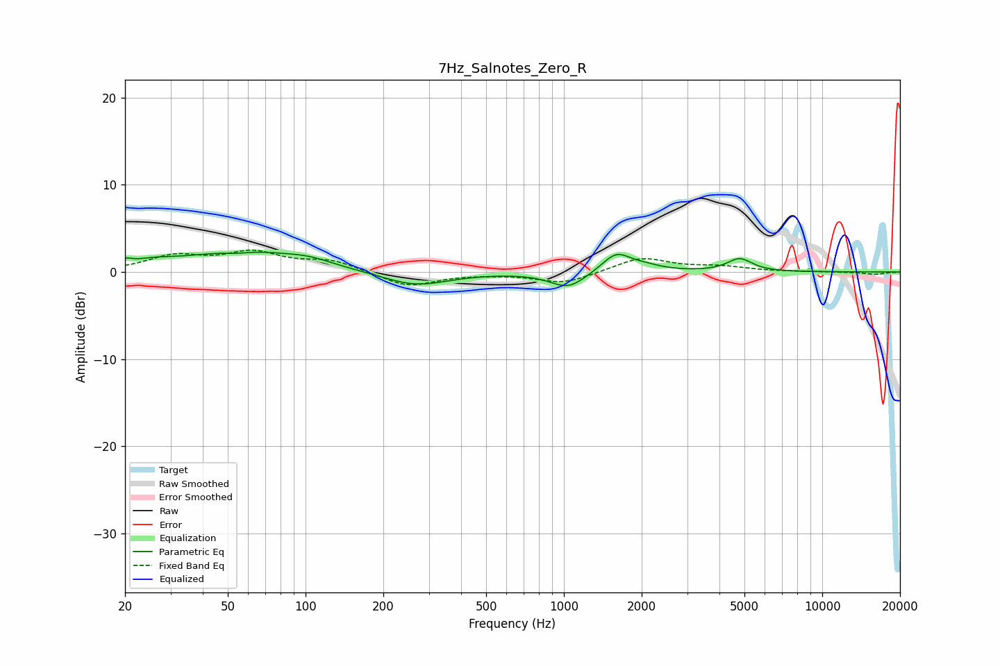

# 7Hz_Salnotes_Zero_R
See [usage instructions](https://github.com/jaakkopasanen/AutoEq#usage) for more options and info.

### Parametric EQs
Apply preamp of -2.4 dB when using parametric equalizer.

|   # | Type    |   Fc (Hz) |    Q |   Gain (dB) |
|-----|---------|-----------|------|-------------|
|   1 | Peaking |        20 | 5.91 |         0.6 |
|   2 | Peaking |        25 | 1.66 |         0.6 |
|   3 | Peaking |        54 | 2.61 |        -0.3 |
|   4 | Peaking |        57 | 0.65 |         2.4 |
|   5 | Peaking |       104 | 1.62 |         0.6 |
|   6 | Peaking |       267 | 1.11 |        -1.6 |
|   7 | Peaking |      1039 | 2.05 |        -1.9 |
|   8 | Peaking |      1596 | 2.52 |         2.2 |
|   9 | Peaking |      2072 | 2.17 |         0.5 |
|  10 | Peaking |      4790 | 2.93 |         1.5 |

### Fixed Band EQs
When using fixed band (also called graphic) equalizer, apply preamp of **-2.6 dB** (if available) and set gains manually with these parameters.

|   # | Type    |   Fc (Hz) |    Q |   Gain (dB) |
|-----|---------|-----------|------|-------------|
|   1 | Peaking |        31 | 1.41 |         1.7 |
|   2 | Peaking |        62 | 1.41 |         2   |
|   3 | Peaking |       125 | 1.41 |         1.2 |
|   4 | Peaking |       250 | 1.41 |        -1.7 |
|   5 | Peaking |       500 | 1.41 |        -0.1 |
|   6 | Peaking |      1000 | 1.41 |        -1.3 |
|   7 | Peaking |      2000 | 1.41 |         1.7 |
|   8 | Peaking |      4000 | 1.41 |         0.5 |
|   9 | Peaking |      8000 | 1.41 |         0   |
|  10 | Peaking |     16000 | 1.41 |        -0.3 |

### Graphs

