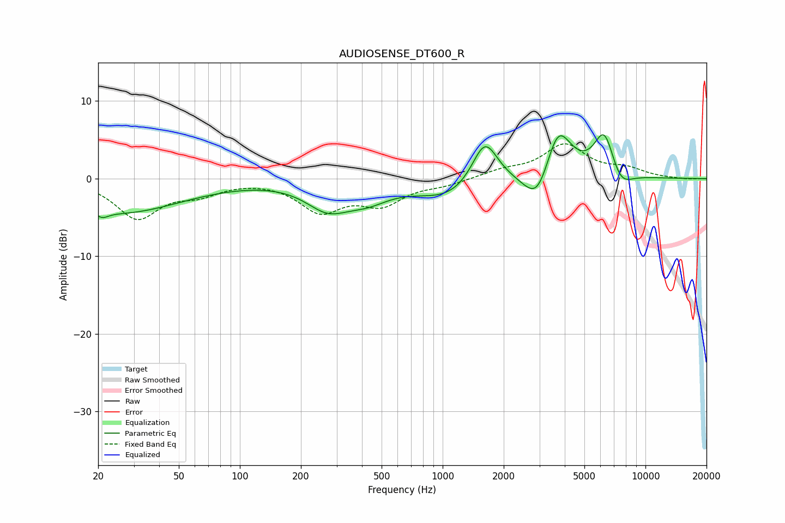

# AUDIOSENSE_DT600_R
See [usage instructions](https://github.com/jaakkopasanen/AutoEq#usage) for more options and info.

### Parametric EQs
Apply preamp of -5.7 dB when using parametric equalizer.

|   # | Type    |   Fc (Hz) |    Q |   Gain (dB) |
|-----|---------|-----------|------|-------------|
|   1 | Peaking |        21 | 4.74 |        -0.8 |
|   2 | Peaking |        25 | 0.46 |        -4.3 |
|   3 | Peaking |       271 | 1.31 |        -3.3 |
|   4 | Peaking |       424 | 1.27 |        -1.9 |
|   5 | Peaking |      1096 | 0.89 |        -2.6 |
|   6 | Peaking |      1614 | 2.16 |         6.1 |
|   7 | Peaking |      2939 | 2.11 |        -4.8 |
|   8 | Peaking |      3701 | 2.11 |         7.2 |
|   9 | Peaking |      6270 | 2.67 |         6   |
|  10 | Peaking |      7507 | 2.44 |        -2.4 |

### Fixed Band EQs
When using fixed band (also called graphic) equalizer, apply preamp of **-4.6 dB** (if available) and set gains manually with these parameters.

|   # | Type    |   Fc (Hz) |    Q |   Gain (dB) |
|-----|---------|-----------|------|-------------|
|   1 | Peaking |        31 | 1.41 |        -4.9 |
|   2 | Peaking |        62 | 1.41 |        -1.6 |
|   3 | Peaking |       125 | 1.41 |        -0   |
|   4 | Peaking |       250 | 1.41 |        -3.9 |
|   5 | Peaking |       500 | 1.41 |        -3   |
|   6 | Peaking |      1000 | 1.41 |        -0.7 |
|   7 | Peaking |      2000 | 1.41 |         0.9 |
|   8 | Peaking |      4000 | 1.41 |         4.2 |
|   9 | Peaking |      8000 | 1.41 |         1.1 |
|  10 | Peaking |     16000 | 1.41 |        -0.1 |

### Graphs

