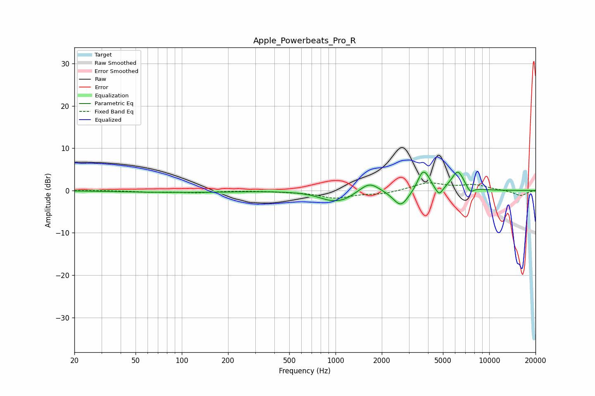

# Apple_Powerbeats_Pro_R
See [usage instructions](https://github.com/jaakkopasanen/AutoEq#usage) for more options and info.

### Parametric EQs
Apply preamp of -4.4 dB when using parametric equalizer.

|   # | Type    |   Fc (Hz) |    Q |   Gain (dB) |
|-----|---------|-----------|------|-------------|
|   1 | Peaking |        93 | 0.39 |        -0.4 |
|   2 | Peaking |       958 | 1.52 |        -2.2 |
|   3 | Peaking |      1167 | 2.5  |        -0.7 |
|   4 | Peaking |      1665 | 2.37 |         2.3 |
|   5 | Peaking |      2657 | 2.87 |        -3.9 |
|   6 | Peaking |      3668 | 4.39 |         4.1 |
|   7 | Peaking |      3969 | 5.56 |         1.4 |
|   8 | Peaking |      4729 | 6    |        -2.1 |
|   9 | Peaking |      6245 | 3.35 |         4.6 |
|  10 | Peaking |      7510 | 5.59 |        -1.5 |

### Fixed Band EQs
When using fixed band (also called graphic) equalizer, apply preamp of **-1.9 dB** (if available) and set gains manually with these parameters.

|   # | Type    |   Fc (Hz) |    Q |   Gain (dB) |
|-----|---------|-----------|------|-------------|
|   1 | Peaking |        31 | 1.41 |         0   |
|   2 | Peaking |        62 | 1.41 |        -0.3 |
|   3 | Peaking |       125 | 1.41 |        -0.5 |
|   4 | Peaking |       250 | 1.41 |        -0   |
|   5 | Peaking |       500 | 1.41 |        -0.2 |
|   6 | Peaking |      1000 | 1.41 |        -1.7 |
|   7 | Peaking |      2000 | 1.41 |        -0.8 |
|   8 | Peaking |      4000 | 1.41 |         1.8 |
|   9 | Peaking |      8000 | 1.41 |         1.2 |
|  10 | Peaking |     16000 | 1.41 |        -1.2 |

### Graphs

