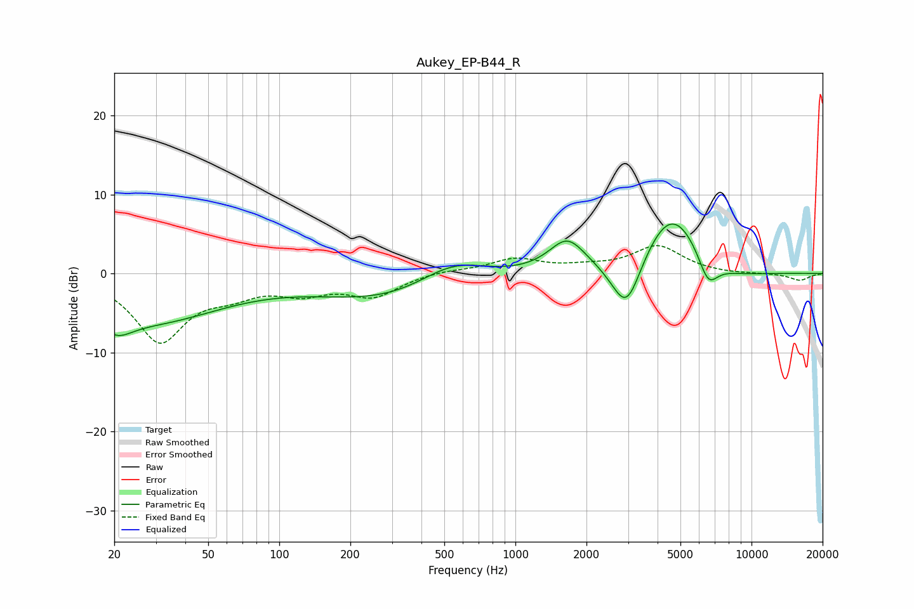

# Aukey_EP-B44_R
See [usage instructions](https://github.com/jaakkopasanen/AutoEq#usage) for more options and info.

### Parametric EQs
Apply preamp of -6.4 dB when using parametric equalizer.

|   # | Type    |   Fc (Hz) |    Q |   Gain (dB) |
|-----|---------|-----------|------|-------------|
|   1 | Peaking |        20 | 2.1  |        -2.4 |
|   2 | Peaking |        28 | 0.45 |        -5.8 |
|   3 | Peaking |       333 | 0.43 |        -3.9 |
|   4 | Peaking |       541 | 0.88 |         3.9 |
|   5 | Peaking |      1656 | 1.85 |         4   |
|   6 | Peaking |      2956 | 2.04 |        -8.2 |
|   7 | Peaking |      4591 | 0.95 |         9.7 |
|   8 | Peaking |      6547 | 3.23 |        -3.8 |
|   9 | Peaking |      6725 | 4.4  |         0   |
|  10 | Peaking |      7392 | 0.84 |        -2.4 |

### Fixed Band EQs
When using fixed band (also called graphic) equalizer, apply preamp of **-3.6 dB** (if available) and set gains manually with these parameters.

|   # | Type    |   Fc (Hz) |    Q |   Gain (dB) |
|-----|---------|-----------|------|-------------|
|   1 | Peaking |        31 | 1.41 |        -8.4 |
|   2 | Peaking |        62 | 1.41 |        -1.9 |
|   3 | Peaking |       125 | 1.41 |        -2.1 |
|   4 | Peaking |       250 | 1.41 |        -2.7 |
|   5 | Peaking |       500 | 1.41 |         0.4 |
|   6 | Peaking |      1000 | 1.41 |         1.8 |
|   7 | Peaking |      2000 | 1.41 |         0.6 |
|   8 | Peaking |      4000 | 1.41 |         3.4 |
|   9 | Peaking |      8000 | 1.41 |        -0.1 |
|  10 | Peaking |     16000 | 1.41 |        -0.9 |

### Graphs

