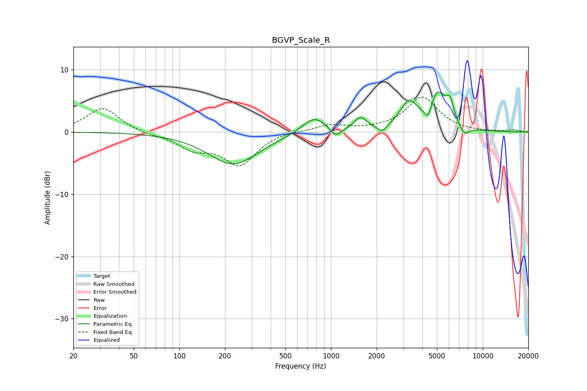

# BGVP_Scale_R
See [usage instructions](https://github.com/jaakkopasanen/AutoEq#usage) for more options and info.

### Parametric EQs
Apply preamp of -6.5 dB when using parametric equalizer.

|   # | Type    |   Fc (Hz) |    Q |   Gain (dB) |
|-----|---------|-----------|------|-------------|
|   1 | Peaking |       227 | 0.86 |        -5.2 |
|   2 | Peaking |       774 | 1.75 |         2.7 |
|   3 | Peaking |      1074 | 3.9  |        -1.5 |
|   4 | Peaking |      1567 | 3.47 |         2   |
|   5 | Peaking |      2173 | 4.97 |        -1.1 |
|   6 | Peaking |      3252 | 2.44 |         4.1 |
|   7 | Peaking |      4375 | 5.79 |        -2.4 |
|   8 | Peaking |      5053 | 2.33 |         6   |
|   9 | Peaking |      6106 | 6    |         2.8 |
|  10 | Peaking |      7592 | 4.25 |        -1.5 |

### Fixed Band EQs
When using fixed band (also called graphic) equalizer, apply preamp of **-5.7 dB** (if available) and set gains manually with these parameters.

|   # | Type    |   Fc (Hz) |    Q |   Gain (dB) |
|-----|---------|-----------|------|-------------|
|   1 | Peaking |        31 | 1.41 |         3.9 |
|   2 | Peaking |        62 | 1.41 |        -0.4 |
|   3 | Peaking |       125 | 1.41 |        -2.4 |
|   4 | Peaking |       250 | 1.41 |        -5.1 |
|   5 | Peaking |       500 | 1.41 |         0.3 |
|   6 | Peaking |      1000 | 1.41 |         1.1 |
|   7 | Peaking |      2000 | 1.41 |         0.2 |
|   8 | Peaking |      4000 | 1.41 |         5.5 |
|   9 | Peaking |      8000 | 1.41 |        -0   |
|  10 | Peaking |     16000 | 1.41 |         0.3 |

### Graphs

