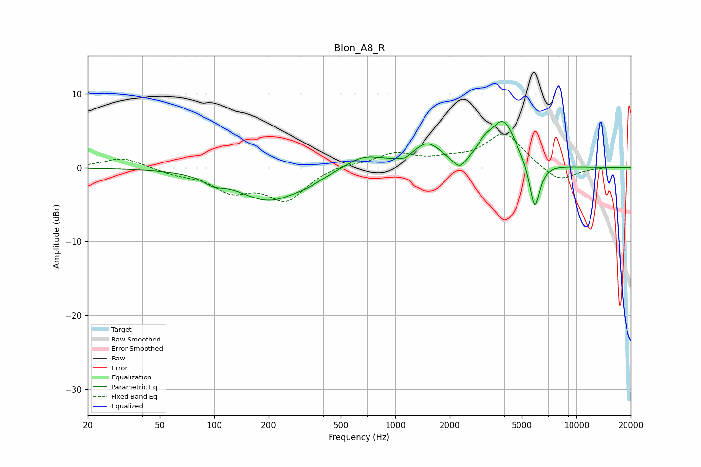

# Blon_A8_R
See [usage instructions](https://github.com/jaakkopasanen/AutoEq#usage) for more options and info.

### Parametric EQs
Apply preamp of -6.4 dB when using parametric equalizer.

|   # | Type    |   Fc (Hz) |    Q |   Gain (dB) |
|-----|---------|-----------|------|-------------|
|   1 | Peaking |        99 | 2.82 |        -0.9 |
|   2 | Peaking |       201 | 0.8  |        -4.4 |
|   3 | Peaking |       332 | 2.12 |        -0.5 |
|   4 | Peaking |       669 | 1.36 |         1.8 |
|   5 | Peaking |      1134 | 5    |        -0.5 |
|   6 | Peaking |      1500 | 1.86 |         3   |
|   7 | Peaking |      2265 | 3.72 |        -1.7 |
|   8 | Peaking |      3120 | 3.19 |         1.6 |
|   9 | Peaking |      3962 | 2.03 |         6.1 |
|  10 | Peaking |      5885 | 4.69 |        -6.6 |

### Fixed Band EQs
When using fixed band (also called graphic) equalizer, apply preamp of **-4.7 dB** (if available) and set gains manually with these parameters.

|   # | Type    |   Fc (Hz) |    Q |   Gain (dB) |
|-----|---------|-----------|------|-------------|
|   1 | Peaking |        31 | 1.41 |         1.4 |
|   2 | Peaking |        62 | 1.41 |        -0.7 |
|   3 | Peaking |       125 | 1.41 |        -2.8 |
|   4 | Peaking |       250 | 1.41 |        -4.2 |
|   5 | Peaking |       500 | 1.41 |         0.5 |
|   6 | Peaking |      1000 | 1.41 |         1.8 |
|   7 | Peaking |      2000 | 1.41 |         0.8 |
|   8 | Peaking |      4000 | 1.41 |         4.7 |
|   9 | Peaking |      8000 | 1.41 |        -2   |
|  10 | Peaking |     16000 | 1.41 |         0.1 |

### Graphs

