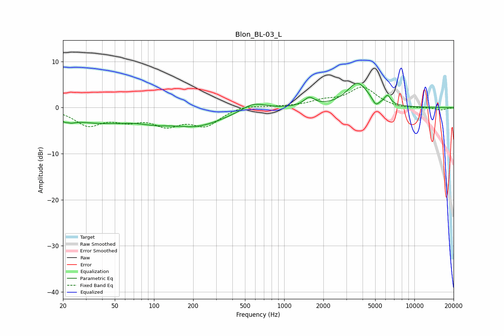

# Blon_BL-03_L
See [usage instructions](https://github.com/jaakkopasanen/AutoEq#usage) for more options and info.

### Parametric EQs
Apply preamp of -5.4 dB when using parametric equalizer.

|   # | Type    |   Fc (Hz) |    Q |   Gain (dB) |
|-----|---------|-----------|------|-------------|
|   1 | Peaking |        22 | 4.68 |        -3.1 |
|   2 | Peaking |        22 | 5.97 |         2.2 |
|   3 | Peaking |        38 | 0.5  |        -3   |
|   4 | Peaking |       102 | 1.35 |        -0.9 |
|   5 | Peaking |       213 | 0.65 |        -3.6 |
|   6 | Peaking |       581 | 1.59 |         1.8 |
|   7 | Peaking |      1558 | 3.41 |         1.8 |
|   8 | Peaking |      3655 | 1.71 |         5.3 |
|   9 | Peaking |      5046 | 5.41 |        -1.6 |
|  10 | Peaking |      6219 | 6    |         1.9 |

### Fixed Band EQs
When using fixed band (also called graphic) equalizer, apply preamp of **-4.6 dB** (if available) and set gains manually with these parameters.

|   # | Type    |   Fc (Hz) |    Q |   Gain (dB) |
|-----|---------|-----------|------|-------------|
|   1 | Peaking |        31 | 1.41 |        -3.6 |
|   2 | Peaking |        62 | 1.41 |        -2.2 |
|   3 | Peaking |       125 | 1.41 |        -3.3 |
|   4 | Peaking |       250 | 1.41 |        -3.6 |
|   5 | Peaking |       500 | 1.41 |         0.7 |
|   6 | Peaking |      1000 | 1.41 |         0.2 |
|   7 | Peaking |      2000 | 1.41 |         1.2 |
|   8 | Peaking |      4000 | 1.41 |         4.3 |
|   9 | Peaking |      8000 | 1.41 |        -0.3 |
|  10 | Peaking |     16000 | 1.41 |        -0.5 |

### Graphs

