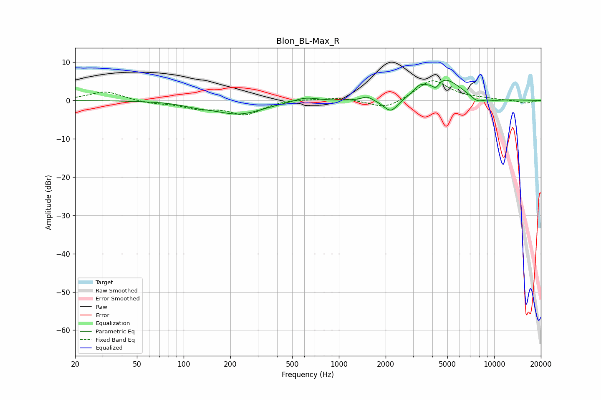

# Blon_BL-Max_R
See [usage instructions](https://github.com/jaakkopasanen/AutoEq#usage) for more options and info.

### Parametric EQs
Apply preamp of -5.4 dB when using parametric equalizer.

|   # | Type    |   Fc (Hz) |    Q |   Gain (dB) |
|-----|---------|-----------|------|-------------|
|   1 | Peaking |       122 | 1.51 |        -0.8 |
|   2 | Peaking |       227 | 0.91 |        -3.5 |
|   3 | Peaking |       607 | 1.89 |         1.2 |
|   4 | Peaking |      1521 | 4.02 |         1.1 |
|   5 | Peaking |      2164 | 2.95 |        -3.7 |
|   6 | Peaking |      3322 | 3.83 |         1.7 |
|   7 | Peaking |      4208 | 6    |        -2   |
|   8 | Peaking |      4715 | 1.29 |         5.9 |
|   9 | Peaking |      7752 | 2.92 |        -1.6 |
|  10 | Peaking |     10000 | 2.36 |        -0.4 |

### Fixed Band EQs
When using fixed band (also called graphic) equalizer, apply preamp of **-5.2 dB** (if available) and set gains manually with these parameters.

|   # | Type    |   Fc (Hz) |    Q |   Gain (dB) |
|-----|---------|-----------|------|-------------|
|   1 | Peaking |        31 | 1.41 |         2.4 |
|   2 | Peaking |        62 | 1.41 |        -0.7 |
|   3 | Peaking |       125 | 1.41 |        -1.8 |
|   4 | Peaking |       250 | 1.41 |        -3.5 |
|   5 | Peaking |       500 | 1.41 |         0.5 |
|   6 | Peaking |      1000 | 1.41 |         0.8 |
|   7 | Peaking |      2000 | 1.41 |        -2.4 |
|   8 | Peaking |      4000 | 1.41 |         5.5 |
|   9 | Peaking |      8000 | 1.41 |         0.3 |
|  10 | Peaking |     16000 | 1.41 |        -0.8 |

### Graphs

