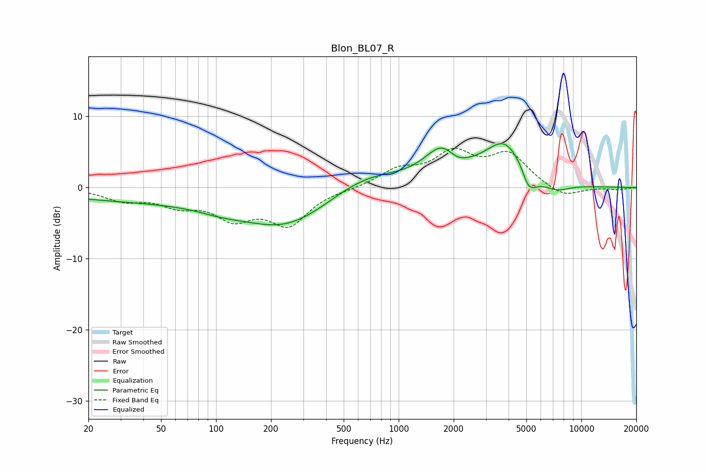

# Blon_BL07_R
See [usage instructions](https://github.com/jaakkopasanen/AutoEq#usage) for more options and info.

### Parametric EQs
Apply preamp of -6.3 dB when using parametric equalizer.

|   # | Type    |   Fc (Hz) |    Q |   Gain (dB) |
|-----|---------|-----------|------|-------------|
|   1 | Peaking |        62 | 0.18 |        -2   |
|   2 | Peaking |       106 | 1.2  |        -0.6 |
|   3 | Peaking |       247 | 0.6  |        -4.3 |
|   4 | Peaking |       660 | 0.71 |         2.5 |
|   5 | Peaking |      1763 | 1.44 |         5.2 |
|   6 | Peaking |      2048 | 2.21 |        -1.7 |
|   7 | Peaking |      3880 | 1.21 |         6.6 |
|   8 | Peaking |      4738 | 3.94 |         1.4 |
|   9 | Peaking |      5041 | 2.71 |        -4.8 |
|  10 | Peaking |      7249 | 1.73 |        -1.3 |

### Fixed Band EQs
When using fixed band (also called graphic) equalizer, apply preamp of **-5.6 dB** (if available) and set gains manually with these parameters.

|   # | Type    |   Fc (Hz) |    Q |   Gain (dB) |
|-----|---------|-----------|------|-------------|
|   1 | Peaking |        31 | 1.41 |        -1.6 |
|   2 | Peaking |        62 | 1.41 |        -2.1 |
|   3 | Peaking |       125 | 1.41 |        -3.8 |
|   4 | Peaking |       250 | 1.41 |        -4.9 |
|   5 | Peaking |       500 | 1.41 |        -0.1 |
|   6 | Peaking |      1000 | 1.41 |         2.3 |
|   7 | Peaking |      2000 | 1.41 |         4.5 |
|   8 | Peaking |      4000 | 1.41 |         4.4 |
|   9 | Peaking |      8000 | 1.41 |        -1.5 |
|  10 | Peaking |     16000 | 1.41 |        -0.3 |

### Graphs

