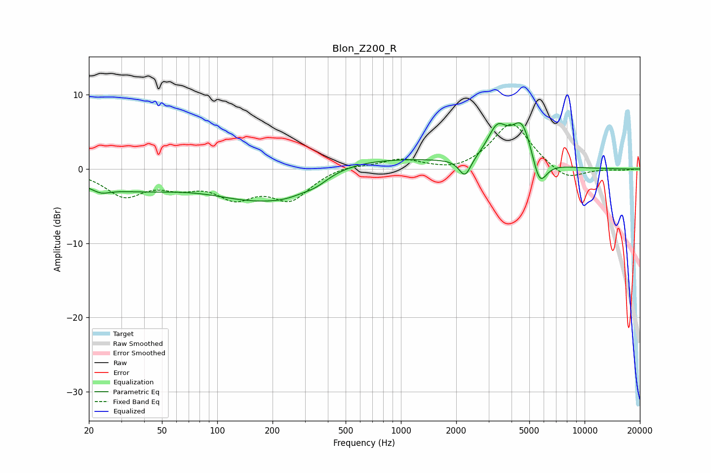

# Blon_Z200_R
See [usage instructions](https://github.com/jaakkopasanen/AutoEq#usage) for more options and info.

### Parametric EQs
Apply preamp of -6.3 dB when using parametric equalizer.

|   # | Type    |   Fc (Hz) |    Q |   Gain (dB) |
|-----|---------|-----------|------|-------------|
|   1 | Peaking |        23 | 3.06 |        -0.7 |
|   2 | Peaking |        33 | 0.45 |        -2.5 |
|   3 | Peaking |       158 | 0.61 |        -3.9 |
|   4 | Peaking |       244 | 1.13 |        -1.7 |
|   5 | Peaking |       345 | 1.88 |        -1.1 |
|   6 | Peaking |       537 | 0.25 |         1.7 |
|   7 | Peaking |      2232 | 4.42 |        -2.5 |
|   8 | Peaking |      3345 | 2.6  |         4.3 |
|   9 | Peaking |      4565 | 2.38 |         5.8 |
|  10 | Peaking |      5675 | 3.43 |        -4.2 |

### Fixed Band EQs
When using fixed band (also called graphic) equalizer, apply preamp of **-6.1 dB** (if available) and set gains manually with these parameters.

|   # | Type    |   Fc (Hz) |    Q |   Gain (dB) |
|-----|---------|-----------|------|-------------|
|   1 | Peaking |        31 | 1.41 |        -3.4 |
|   2 | Peaking |        62 | 1.41 |        -1.8 |
|   3 | Peaking |       125 | 1.41 |        -3.3 |
|   4 | Peaking |       250 | 1.41 |        -3.8 |
|   5 | Peaking |       500 | 1.41 |         0.6 |
|   6 | Peaking |      1000 | 1.41 |         1.3 |
|   7 | Peaking |      2000 | 1.41 |        -0.6 |
|   8 | Peaking |      4000 | 1.41 |         6.3 |
|   9 | Peaking |      8000 | 1.41 |        -1.7 |
|  10 | Peaking |     16000 | 1.41 |        -0.1 |

### Graphs

