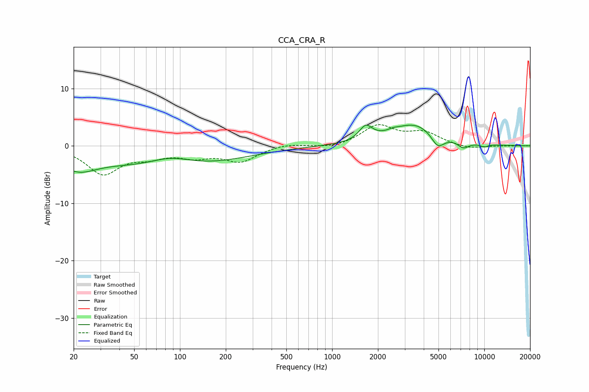

# CCA_CRA_R
See [usage instructions](https://github.com/jaakkopasanen/AutoEq#usage) for more options and info.

### Parametric EQs
Apply preamp of -3.7 dB when using parametric equalizer.

|   # | Type    |   Fc (Hz) |    Q |   Gain (dB) |
|-----|---------|-----------|------|-------------|
|   1 | Peaking |        21 | 1.13 |        -3.1 |
|   2 | Peaking |        86 | 0.33 |        -4.2 |
|   3 | Peaking |        87 | 0.94 |         2.1 |
|   4 | Peaking |      1663 | 3.31 |         2.5 |
|   5 | Peaking |      2517 | 4.87 |         0.3 |
|   6 | Peaking |      3504 | 0.88 |         3.9 |
|   7 | Peaking |      4939 | 3.16 |        -2.5 |
|   8 | Peaking |      7273 | 3.6  |        -1.2 |
|   9 | Peaking |      9178 | 2.09 |        -0   |
|  10 | Peaking |     10000 | 4.8  |        -0.5 |

### Fixed Band EQs
When using fixed band (also called graphic) equalizer, apply preamp of **-3.8 dB** (if available) and set gains manually with these parameters.

|   # | Type    |   Fc (Hz) |    Q |   Gain (dB) |
|-----|---------|-----------|------|-------------|
|   1 | Peaking |        31 | 1.41 |        -4.7 |
|   2 | Peaking |        62 | 1.41 |        -1.5 |
|   3 | Peaking |       125 | 1.41 |        -1.6 |
|   4 | Peaking |       250 | 1.41 |        -2.6 |
|   5 | Peaking |       500 | 1.41 |         0.5 |
|   6 | Peaking |      1000 | 1.41 |        -0.5 |
|   7 | Peaking |      2000 | 1.41 |         3.4 |
|   8 | Peaking |      4000 | 1.41 |         2.1 |
|   9 | Peaking |      8000 | 1.41 |        -0.6 |
|  10 | Peaking |     16000 | 1.41 |        -0   |

### Graphs

