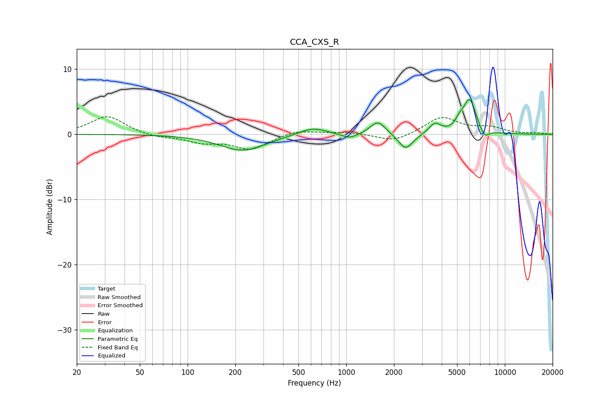

# CCA_CXS_R
See [usage instructions](https://github.com/jaakkopasanen/AutoEq#usage) for more options and info.

### Parametric EQs
Apply preamp of -5.4 dB when using parametric equalizer.

|   # | Type    |   Fc (Hz) |    Q |   Gain (dB) |
|-----|---------|-----------|------|-------------|
|   1 | Peaking |       222 | 0.99 |        -2.5 |
|   2 | Peaking |       609 | 1.59 |         1.2 |
|   3 | Peaking |      1048 | 2.89 |        -0.8 |
|   4 | Peaking |      1582 | 3.07 |         2   |
|   5 | Peaking |      2353 | 3.47 |        -2   |
|   6 | Peaking |      2511 | 2.42 |        -0.5 |
|   7 | Peaking |      3617 | 3.85 |         1.6 |
|   8 | Peaking |      5181 | 6    |         1   |
|   9 | Peaking |      5999 | 3.4  |         5.3 |
|  10 | Peaking |      7426 | 4.73 |        -1.4 |

### Fixed Band EQs
When using fixed band (also called graphic) equalizer, apply preamp of **-2.8 dB** (if available) and set gains manually with these parameters.

|   # | Type    |   Fc (Hz) |    Q |   Gain (dB) |
|-----|---------|-----------|------|-------------|
|   1 | Peaking |        31 | 1.41 |         2.8 |
|   2 | Peaking |        62 | 1.41 |        -0.5 |
|   3 | Peaking |       125 | 1.41 |        -1.1 |
|   4 | Peaking |       250 | 1.41 |        -2.2 |
|   5 | Peaking |       500 | 1.41 |         0.7 |
|   6 | Peaking |      1000 | 1.41 |         0.3 |
|   7 | Peaking |      2000 | 1.41 |        -1.2 |
|   8 | Peaking |      4000 | 1.41 |         2.6 |
|   9 | Peaking |      8000 | 1.41 |         0.9 |
|  10 | Peaking |     16000 | 1.41 |         0.2 |

### Graphs

