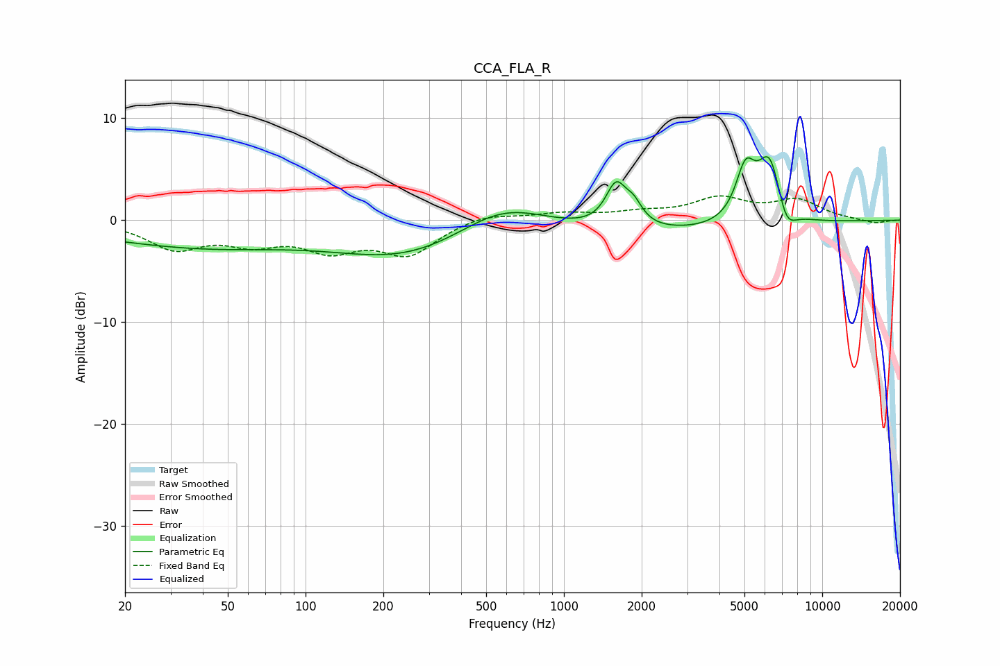

# CCA_FLA_R
See [usage instructions](https://github.com/jaakkopasanen/AutoEq#usage) for more options and info.

### Parametric EQs
Apply preamp of -6.3 dB when using parametric equalizer.

|   # | Type    |   Fc (Hz) |    Q |   Gain (dB) |
|-----|---------|-----------|------|-------------|
|   1 | Peaking |        25 | 0.36 |        -1.4 |
|   2 | Peaking |        52 | 0.44 |        -1.3 |
|   3 | Peaking |       248 | 0.5  |        -3.5 |
|   4 | Peaking |       578 | 0.81 |         3   |
|   5 | Peaking |      1591 | 3.54 |         4   |
|   6 | Peaking |      1863 | 4.19 |         1.7 |
|   7 | Peaking |      2328 | 0.31 |        -1.4 |
|   8 | Peaking |      5044 | 3.67 |         4.8 |
|   9 | Peaking |      6271 | 2.78 |         6.8 |
|  10 | Peaking |      7224 | 3.51 |        -2.8 |

### Fixed Band EQs
When using fixed band (also called graphic) equalizer, apply preamp of **-2.5 dB** (if available) and set gains manually with these parameters.

|   # | Type    |   Fc (Hz) |    Q |   Gain (dB) |
|-----|---------|-----------|------|-------------|
|   1 | Peaking |        31 | 1.41 |        -2.6 |
|   2 | Peaking |        62 | 1.41 |        -1.9 |
|   3 | Peaking |       125 | 1.41 |        -2.5 |
|   4 | Peaking |       250 | 1.41 |        -3.2 |
|   5 | Peaking |       500 | 1.41 |         0.7 |
|   6 | Peaking |      1000 | 1.41 |         0.6 |
|   7 | Peaking |      2000 | 1.41 |         0.6 |
|   8 | Peaking |      4000 | 1.41 |         2   |
|   9 | Peaking |      8000 | 1.41 |         1.8 |
|  10 | Peaking |     16000 | 1.41 |        -0.3 |

### Graphs

