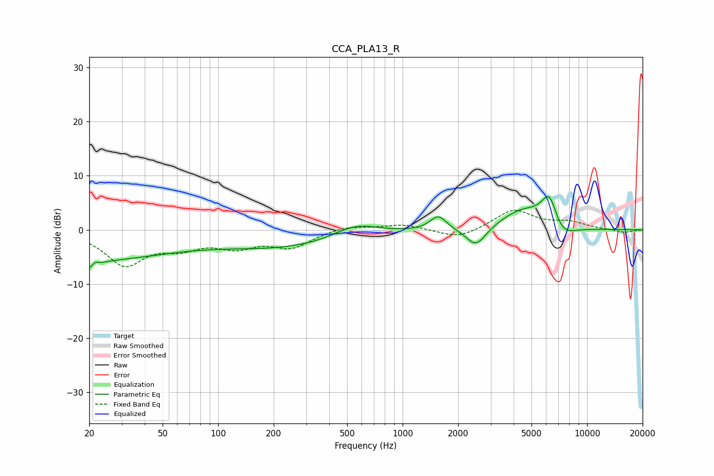

# CCA_PLA13_R
See [usage instructions](https://github.com/jaakkopasanen/AutoEq#usage) for more options and info.

### Parametric EQs
Apply preamp of -6.3 dB when using parametric equalizer.

|   # | Type    |   Fc (Hz) |    Q |   Gain (dB) |
|-----|---------|-----------|------|-------------|
|   1 | Peaking |        21 | 0.32 |        -5.3 |
|   2 | Peaking |        21 | 4.48 |        -3.8 |
|   3 | Peaking |        21 | 6    |         3   |
|   4 | Peaking |       239 | 0.38 |        -3.2 |
|   5 | Peaking |       555 | 1.1  |         2.7 |
|   6 | Peaking |      1562 | 3.23 |         2.7 |
|   7 | Peaking |      2502 | 2.55 |        -3.7 |
|   8 | Peaking |      4486 | 1.14 |         3.7 |
|   9 | Peaking |      6249 | 3.07 |         6.2 |
|  10 | Peaking |      7198 | 1.91 |        -3.2 |

### Fixed Band EQs
When using fixed band (also called graphic) equalizer, apply preamp of **-3.7 dB** (if available) and set gains manually with these parameters.

|   # | Type    |   Fc (Hz) |    Q |   Gain (dB) |
|-----|---------|-----------|------|-------------|
|   1 | Peaking |        31 | 1.41 |        -6.2 |
|   2 | Peaking |        62 | 1.41 |        -2.6 |
|   3 | Peaking |       125 | 1.41 |        -2.7 |
|   4 | Peaking |       250 | 1.41 |        -3   |
|   5 | Peaking |       500 | 1.41 |         0.8 |
|   6 | Peaking |      1000 | 1.41 |         1   |
|   7 | Peaking |      2000 | 1.41 |        -1.7 |
|   8 | Peaking |      4000 | 1.41 |         3.7 |
|   9 | Peaking |      8000 | 1.41 |         1.3 |
|  10 | Peaking |     16000 | 1.41 |        -0.5 |

### Graphs

