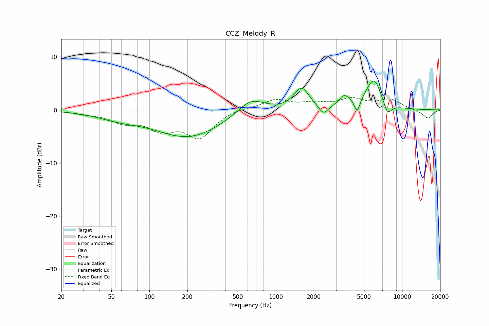

# CCZ_Melody_R
See [usage instructions](https://github.com/jaakkopasanen/AutoEq#usage) for more options and info.

### Parametric EQs
Apply preamp of -5.5 dB when using parametric equalizer.

|   # | Type    |   Fc (Hz) |    Q |   Gain (dB) |
|-----|---------|-----------|------|-------------|
|   1 | Peaking |        57 | 0.83 |        -1.2 |
|   2 | Peaking |       204 | 0.53 |        -5.1 |
|   3 | Peaking |       636 | 1.32 |         2.9 |
|   4 | Peaking |      1603 | 2.36 |         4   |
|   5 | Peaking |      2382 | 3.87 |        -1.8 |
|   6 | Peaking |      3445 | 3.76 |         1.6 |
|   7 | Peaking |      3842 | 2.45 |         0.8 |
|   8 | Peaking |      4411 | 6    |        -2.6 |
|   9 | Peaking |      5972 | 2.16 |         5.7 |
|  10 | Peaking |      7657 | 4.03 |        -2.5 |

### Fixed Band EQs
When using fixed band (also called graphic) equalizer, apply preamp of **-2.4 dB** (if available) and set gains manually with these parameters.

|   # | Type    |   Fc (Hz) |    Q |   Gain (dB) |
|-----|---------|-----------|------|-------------|
|   1 | Peaking |        31 | 1.41 |        -0.5 |
|   2 | Peaking |        62 | 1.41 |        -2   |
|   3 | Peaking |       125 | 1.41 |        -3.3 |
|   4 | Peaking |       250 | 1.41 |        -4.9 |
|   5 | Peaking |       500 | 1.41 |         0.4 |
|   6 | Peaking |      1000 | 1.41 |         1.8 |
|   7 | Peaking |      2000 | 1.41 |         1   |
|   8 | Peaking |      4000 | 1.41 |         1.8 |
|   9 | Peaking |      8000 | 1.41 |         1.8 |
|  10 | Peaking |     16000 | 1.41 |        -1.6 |

### Graphs

