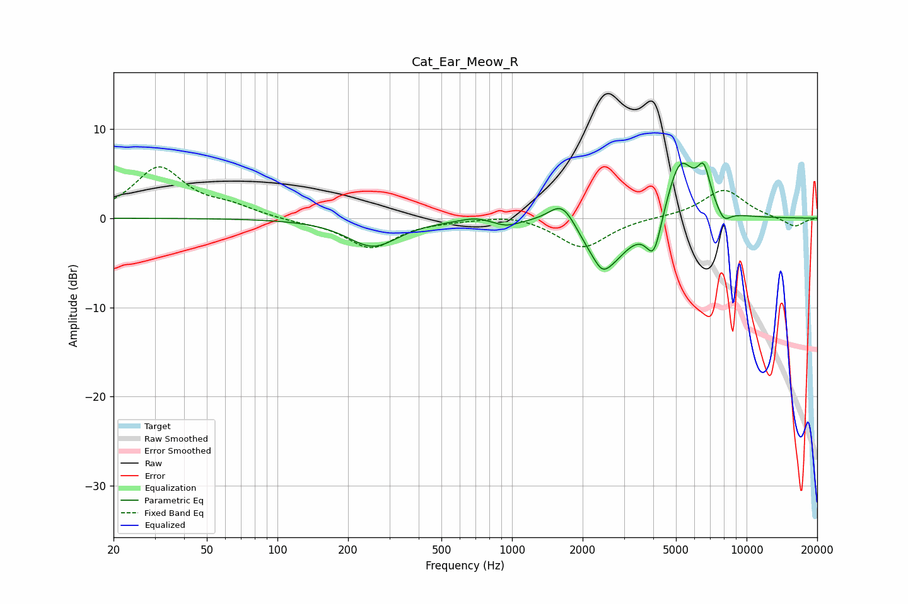

# Cat_Ear_Meow_R
See [usage instructions](https://github.com/jaakkopasanen/AutoEq#usage) for more options and info.

### Parametric EQs
Apply preamp of -6.3 dB when using parametric equalizer.

|   # | Type    |   Fc (Hz) |    Q |   Gain (dB) |
|-----|---------|-----------|------|-------------|
|   1 | Peaking |       255 | 1.31 |        -3.1 |
|   2 | Peaking |       694 | 2.4  |         0.5 |
|   3 | Peaking |       945 | 2.75 |        -0.7 |
|   4 | Peaking |      1645 | 2.34 |         3.2 |
|   5 | Peaking |      2424 | 4.85 |        -0.9 |
|   6 | Peaking |      2489 | 1.46 |        -5.8 |
|   7 | Peaking |      4029 | 4.1  |        -4.7 |
|   8 | Peaking |      5206 | 2.25 |         7.1 |
|   9 | Peaking |      6572 | 4.79 |         4   |
|  10 | Peaking |      7996 | 4.57 |        -1.4 |

### Fixed Band EQs
When using fixed band (also called graphic) equalizer, apply preamp of **-5.8 dB** (if available) and set gains manually with these parameters.

|   # | Type    |   Fc (Hz) |    Q |   Gain (dB) |
|-----|---------|-----------|------|-------------|
|   1 | Peaking |        31 | 1.41 |         5.6 |
|   2 | Peaking |        62 | 1.41 |         1.1 |
|   3 | Peaking |       125 | 1.41 |        -0.3 |
|   4 | Peaking |       250 | 1.41 |        -3.3 |
|   5 | Peaking |       500 | 1.41 |        -0.1 |
|   6 | Peaking |      1000 | 1.41 |         0.5 |
|   7 | Peaking |      2000 | 1.41 |        -3.4 |
|   8 | Peaking |      4000 | 1.41 |         0.1 |
|   9 | Peaking |      8000 | 1.41 |         3.2 |
|  10 | Peaking |     16000 | 1.41 |        -1   |

### Graphs

