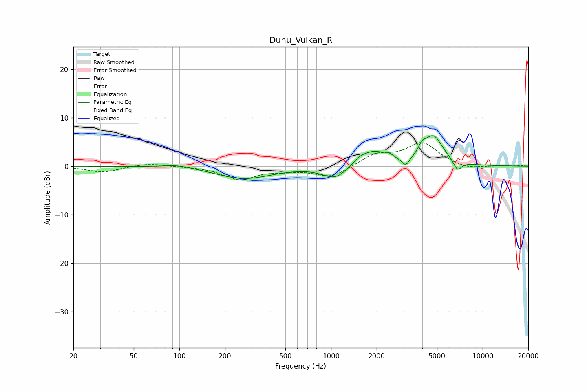

# Dunu_Vulkan_R
See [usage instructions](https://github.com/jaakkopasanen/AutoEq#usage) for more options and info.

### Parametric EQs
Apply preamp of -6.4 dB when using parametric equalizer.

|   # | Type    |   Fc (Hz) |    Q |   Gain (dB) |
|-----|---------|-----------|------|-------------|
|   1 | Peaking |        97 | 1.53 |         0.6 |
|   2 | Peaking |       267 | 0.79 |        -2.6 |
|   3 | Peaking |      1063 | 1.75 |        -2.6 |
|   4 | Peaking |      1542 | 3.41 |         1   |
|   5 | Peaking |      1895 | 1.78 |         2.8 |
|   6 | Peaking |      2402 | 4.23 |         1   |
|   7 | Peaking |      3109 | 5.7  |        -1.7 |
|   8 | Peaking |      3989 | 5.72 |         1.6 |
|   9 | Peaking |      4731 | 2.18 |         6   |
|  10 | Peaking |      6827 | 5.12 |        -2.1 |

### Fixed Band EQs
When using fixed band (also called graphic) equalizer, apply preamp of **-5.0 dB** (if available) and set gains manually with these parameters.

|   # | Type    |   Fc (Hz) |    Q |   Gain (dB) |
|-----|---------|-----------|------|-------------|
|   1 | Peaking |        31 | 1.41 |        -1.3 |
|   2 | Peaking |        62 | 1.41 |         0.7 |
|   3 | Peaking |       125 | 1.41 |        -0   |
|   4 | Peaking |       250 | 1.41 |        -2.7 |
|   5 | Peaking |       500 | 1.41 |        -0.6 |
|   6 | Peaking |      1000 | 1.41 |        -2.3 |
|   7 | Peaking |      2000 | 1.41 |         2.3 |
|   8 | Peaking |      4000 | 1.41 |         4.6 |
|   9 | Peaking |      8000 | 1.41 |        -0.7 |
|  10 | Peaking |     16000 | 1.41 |         0.2 |

### Graphs

