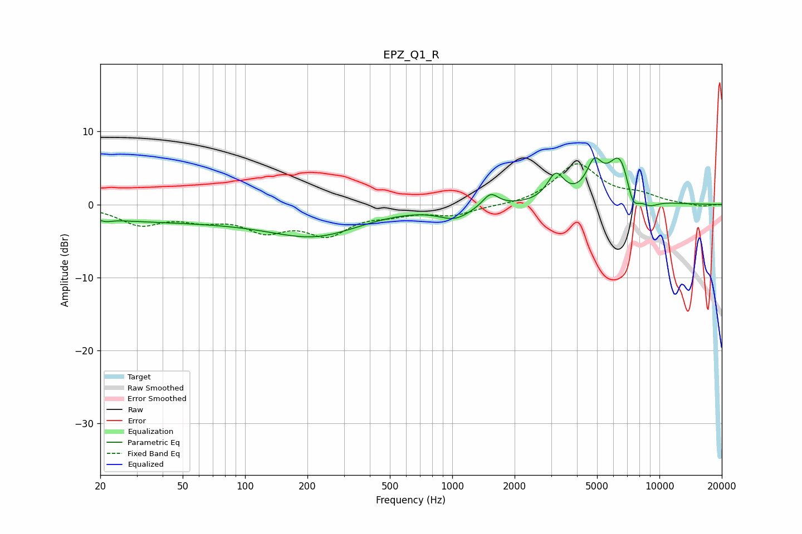

# EPZ_Q1_R
See [usage instructions](https://github.com/jaakkopasanen/AutoEq#usage) for more options and info.

### Parametric EQs
Apply preamp of -6.5 dB when using parametric equalizer.

|   # | Type    |   Fc (Hz) |    Q |   Gain (dB) |
|-----|---------|-----------|------|-------------|
|   1 | Peaking |        21 | 5.62 |        -0.3 |
|   2 | Peaking |        41 | 0.24 |        -2.2 |
|   3 | Peaking |       223 | 0.64 |        -3.5 |
|   4 | Peaking |      1027 | 1.85 |        -1.7 |
|   5 | Peaking |      1529 | 3.84 |         1.8 |
|   6 | Peaking |      3161 | 3.49 |         3.6 |
|   7 | Peaking |      4848 | 3.68 |         4.2 |
|   8 | Peaking |      6478 | 2.32 |         6.9 |
|   9 | Peaking |      7416 | 4.05 |        -3.6 |
|  10 | Peaking |      8918 | 2.79 |        -1.1 |

### Fixed Band EQs
When using fixed band (also called graphic) equalizer, apply preamp of **-5.7 dB** (if available) and set gains manually with these parameters.

|   # | Type    |   Fc (Hz) |    Q |   Gain (dB) |
|-----|---------|-----------|------|-------------|
|   1 | Peaking |        31 | 1.41 |        -2.5 |
|   2 | Peaking |        62 | 1.41 |        -1.6 |
|   3 | Peaking |       125 | 1.41 |        -3.1 |
|   4 | Peaking |       250 | 1.41 |        -3.7 |
|   5 | Peaking |       500 | 1.41 |        -1   |
|   6 | Peaking |      1000 | 1.41 |        -1.4 |
|   7 | Peaking |      2000 | 1.41 |        -0.2 |
|   8 | Peaking |      4000 | 1.41 |         5.5 |
|   9 | Peaking |      8000 | 1.41 |         1.1 |
|  10 | Peaking |     16000 | 1.41 |        -0.3 |

### Graphs

