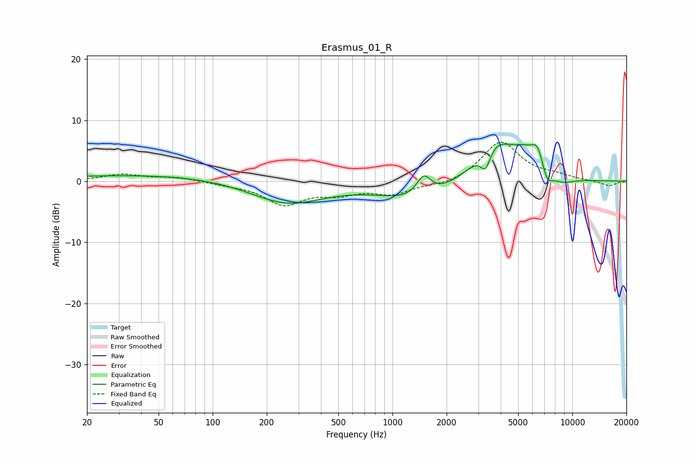

# Erasmus_01_R
See [usage instructions](https://github.com/jaakkopasanen/AutoEq#usage) for more options and info.

### Parametric EQs
Apply preamp of -6.2 dB when using parametric equalizer.

|   # | Type    |   Fc (Hz) |    Q |   Gain (dB) |
|-----|---------|-----------|------|-------------|
|   1 | Peaking |        65 | 0.18 |         1.1 |
|   2 | Peaking |       257 | 0.67 |        -4.1 |
|   3 | Peaking |      1411 | 0.68 |        -3.3 |
|   4 | Peaking |      1493 | 3.54 |         3.3 |
|   5 | Peaking |      3295 | 5.15 |        -3.3 |
|   6 | Peaking |      3728 | 1.17 |         6.8 |
|   7 | Peaking |      5349 | 2.32 |         2   |
|   8 | Peaking |      6433 | 3.43 |         4.2 |
|   9 | Peaking |      7198 | 4.16 |        -2.9 |
|  10 | Peaking |      8760 | 1.91 |        -1.1 |

### Fixed Band EQs
When using fixed band (also called graphic) equalizer, apply preamp of **-6.5 dB** (if available) and set gains manually with these parameters.

|   # | Type    |   Fc (Hz) |    Q |   Gain (dB) |
|-----|---------|-----------|------|-------------|
|   1 | Peaking |        31 | 1.41 |         1.1 |
|   2 | Peaking |        62 | 1.41 |         0.6 |
|   3 | Peaking |       125 | 1.41 |        -0.4 |
|   4 | Peaking |       250 | 1.41 |        -3.6 |
|   5 | Peaking |       500 | 1.41 |        -1.7 |
|   6 | Peaking |      1000 | 1.41 |        -1.9 |
|   7 | Peaking |      2000 | 1.41 |        -0.7 |
|   8 | Peaking |      4000 | 1.41 |         6.5 |
|   9 | Peaking |      8000 | 1.41 |         0.7 |
|  10 | Peaking |     16000 | 1.41 |        -0.8 |

### Graphs

