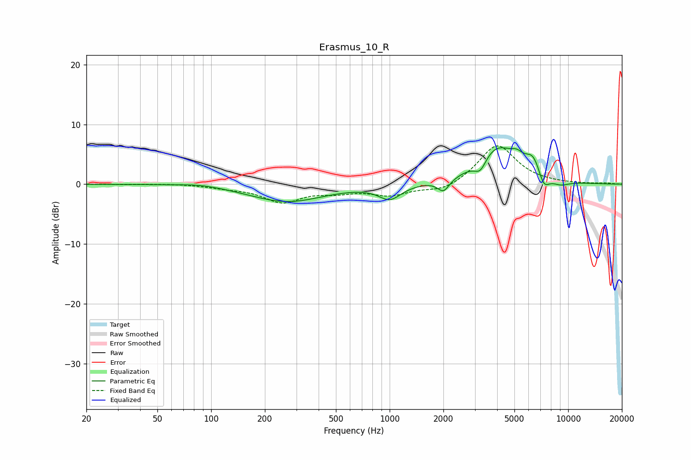

# Erasmus_10_R
See [usage instructions](https://github.com/jaakkopasanen/AutoEq#usage) for more options and info.

### Parametric EQs
Apply preamp of -6.2 dB when using parametric equalizer.

|   # | Type    |   Fc (Hz) |    Q |   Gain (dB) |
|-----|---------|-----------|------|-------------|
|   1 | Peaking |        88 | 1.14 |         0.4 |
|   2 | Peaking |       265 | 0.68 |        -2.9 |
|   3 | Peaking |      1004 | 2.26 |        -2.4 |
|   4 | Peaking |      2004 | 4.31 |        -2.1 |
|   5 | Peaking |      3222 | 4.19 |        -2.2 |
|   6 | Peaking |      3971 | 1.25 |         6.2 |
|   7 | Peaking |      5166 | 3.96 |         1.3 |
|   8 | Peaking |      6366 | 3.17 |         3.1 |
|   9 | Peaking |      7300 | 4.29 |        -2.5 |
|  10 | Peaking |      9029 | 2.5  |        -0.9 |

### Fixed Band EQs
When using fixed band (also called graphic) equalizer, apply preamp of **-6.5 dB** (if available) and set gains manually with these parameters.

|   # | Type    |   Fc (Hz) |    Q |   Gain (dB) |
|-----|---------|-----------|------|-------------|
|   1 | Peaking |        31 | 1.41 |        -0   |
|   2 | Peaking |        62 | 1.41 |         0.1 |
|   3 | Peaking |       125 | 1.41 |        -0.5 |
|   4 | Peaking |       250 | 1.41 |        -2.8 |
|   5 | Peaking |       500 | 1.41 |        -1   |
|   6 | Peaking |      1000 | 1.41 |        -1.7 |
|   7 | Peaking |      2000 | 1.41 |        -1.3 |
|   8 | Peaking |      4000 | 1.41 |         6.7 |
|   9 | Peaking |      8000 | 1.41 |         0   |
|  10 | Peaking |     16000 | 1.41 |         0.2 |

### Graphs

