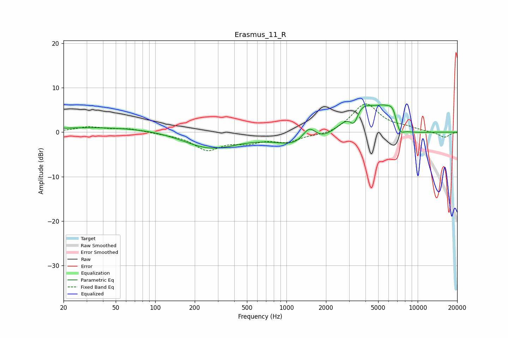

# Erasmus_11_R
See [usage instructions](https://github.com/jaakkopasanen/AutoEq#usage) for more options and info.

### Parametric EQs
Apply preamp of -6.2 dB when using parametric equalizer.

|   # | Type    |   Fc (Hz) |    Q |   Gain (dB) |
|-----|---------|-----------|------|-------------|
|   1 | Peaking |        61 | 0.2  |         1.2 |
|   2 | Peaking |       259 | 0.66 |        -4.1 |
|   3 | Peaking |      1490 | 0.88 |        -5.5 |
|   4 | Peaking |      1490 | 2.29 |         5.2 |
|   5 | Peaking |      3273 | 4.4  |        -3.5 |
|   6 | Peaking |      3659 | 1.08 |         7.2 |
|   7 | Peaking |      5472 | 2.13 |         2.4 |
|   8 | Peaking |      6509 | 3.11 |         4.2 |
|   9 | Peaking |      7221 | 3.88 |        -3.2 |
|  10 | Peaking |      7918 | 0.97 |        -1.2 |

### Fixed Band EQs
When using fixed band (also called graphic) equalizer, apply preamp of **-6.4 dB** (if available) and set gains manually with these parameters.

|   # | Type    |   Fc (Hz) |    Q |   Gain (dB) |
|-----|---------|-----------|------|-------------|
|   1 | Peaking |        31 | 1.41 |         1.1 |
|   2 | Peaking |        62 | 1.41 |         0.7 |
|   3 | Peaking |       125 | 1.41 |        -0.3 |
|   4 | Peaking |       250 | 1.41 |        -3.7 |
|   5 | Peaking |       500 | 1.41 |        -1.8 |
|   6 | Peaking |      1000 | 1.41 |        -2   |
|   7 | Peaking |      2000 | 1.41 |        -0.8 |
|   8 | Peaking |      4000 | 1.41 |         6.5 |
|   9 | Peaking |      8000 | 1.41 |         0.8 |
|  10 | Peaking |     16000 | 1.41 |        -1.2 |

### Graphs

