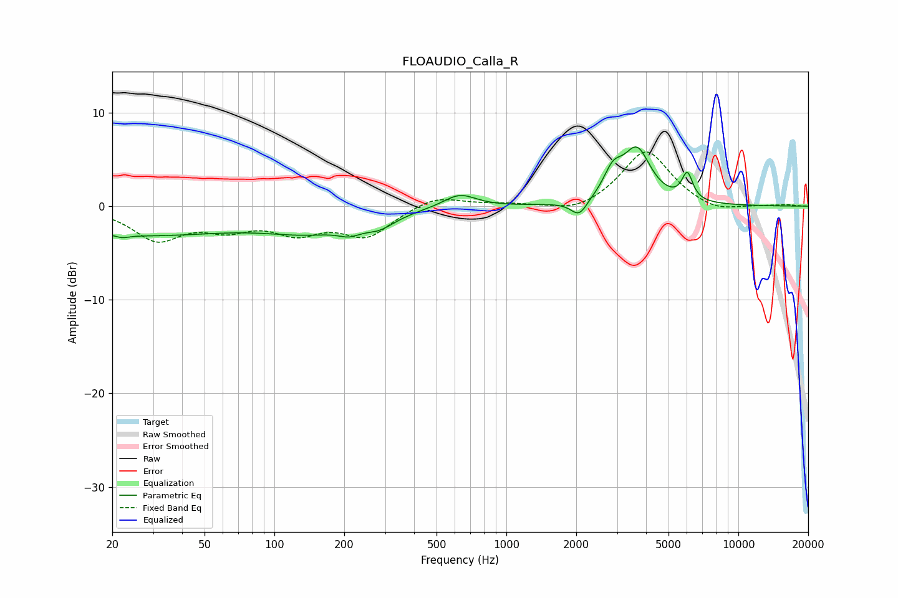

# FLOAUDIO_Calla_R
See [usage instructions](https://github.com/jaakkopasanen/AutoEq#usage) for more options and info.

### Parametric EQs
Apply preamp of -6.4 dB when using parametric equalizer.

|   # | Type    |   Fc (Hz) |    Q |   Gain (dB) |
|-----|---------|-----------|------|-------------|
|   1 | Peaking |        22 | 5.08 |        -0.3 |
|   2 | Peaking |        26 | 0.32 |        -3   |
|   3 | Peaking |       144 | 0.71 |        -2.1 |
|   4 | Peaking |       210 | 2.97 |        -0.8 |
|   5 | Peaking |       283 | 2.03 |        -1.3 |
|   6 | Peaking |       628 | 2.01 |         1.5 |
|   7 | Peaking |      2059 | 4.05 |        -1.7 |
|   8 | Peaking |      2879 | 3.48 |         2.6 |
|   9 | Peaking |      3654 | 2.34 |         5.7 |
|  10 | Peaking |      6025 | 6    |         2.8 |

### Fixed Band EQs
When using fixed band (also called graphic) equalizer, apply preamp of **-5.9 dB** (if available) and set gains manually with these parameters.

|   # | Type    |   Fc (Hz) |    Q |   Gain (dB) |
|-----|---------|-----------|------|-------------|
|   1 | Peaking |        31 | 1.41 |        -3.4 |
|   2 | Peaking |        62 | 1.41 |        -1.9 |
|   3 | Peaking |       125 | 1.41 |        -2.4 |
|   4 | Peaking |       250 | 1.41 |        -3   |
|   5 | Peaking |       500 | 1.41 |         1.2 |
|   6 | Peaking |      1000 | 1.41 |         0.2 |
|   7 | Peaking |      2000 | 1.41 |        -0.9 |
|   8 | Peaking |      4000 | 1.41 |         6   |
|   9 | Peaking |      8000 | 1.41 |        -0.8 |
|  10 | Peaking |     16000 | 1.41 |         0.1 |

### Graphs

