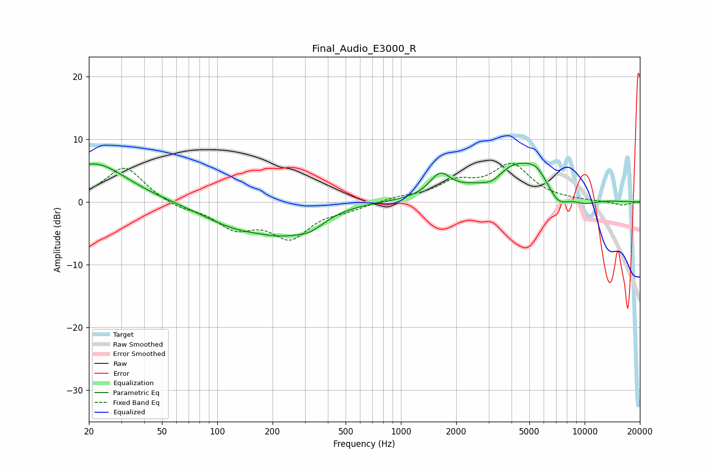

# Final_Audio_E3000_R
See [usage instructions](https://github.com/jaakkopasanen/AutoEq#usage) for more options and info.

### Parametric EQs
Apply preamp of -6.3 dB when using parametric equalizer.

|   # | Type    |   Fc (Hz) |    Q |   Gain (dB) |
|-----|---------|-----------|------|-------------|
|   1 | Peaking |        21 | 0.79 |         6.2 |
|   2 | Peaking |       130 | 0.73 |        -3.6 |
|   3 | Peaking |       221 | 1.17 |        -2.3 |
|   4 | Peaking |       318 | 1.51 |        -2.5 |
|   5 | Peaking |      1634 | 2.52 |         3.4 |
|   6 | Peaking |      3150 | 2.13 |        -1.9 |
|   7 | Peaking |      4124 | 0.84 |         6.4 |
|   8 | Peaking |      5503 | 2.43 |         1.8 |
|   9 | Peaking |      7159 | 2.25 |        -2.7 |
|  10 | Peaking |     10000 | 1.7  |        -1   |

### Fixed Band EQs
When using fixed band (also called graphic) equalizer, apply preamp of **-6.3 dB** (if available) and set gains manually with these parameters.

|   # | Type    |   Fc (Hz) |    Q |   Gain (dB) |
|-----|---------|-----------|------|-------------|
|   1 | Peaking |        31 | 1.41 |         5.7 |
|   2 | Peaking |        62 | 1.41 |        -1   |
|   3 | Peaking |       125 | 1.41 |        -3.7 |
|   4 | Peaking |       250 | 1.41 |        -5.3 |
|   5 | Peaking |       500 | 1.41 |        -0.9 |
|   6 | Peaking |      1000 | 1.41 |         0.6 |
|   7 | Peaking |      2000 | 1.41 |         2.8 |
|   8 | Peaking |      4000 | 1.41 |         5.6 |
|   9 | Peaking |      8000 | 1.41 |         0.1 |
|  10 | Peaking |     16000 | 1.41 |        -0.6 |

### Graphs

