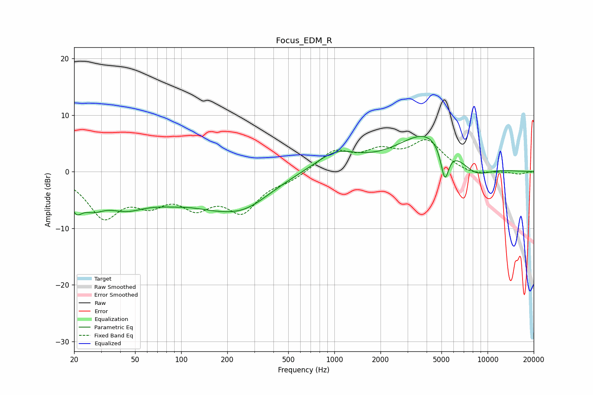

# Focus_EDM_R
See [usage instructions](https://github.com/jaakkopasanen/AutoEq#usage) for more options and info.

### Parametric EQs
Apply preamp of -6.3 dB when using parametric equalizer.

|   # | Type    |   Fc (Hz) |    Q |   Gain (dB) |
|-----|---------|-----------|------|-------------|
|   1 | Peaking |        21 | 3.43 |        -3.9 |
|   2 | Peaking |        26 | 1.76 |        -3.5 |
|   3 | Peaking |        43 | 1.06 |        -3.8 |
|   4 | Peaking |       116 | 1.03 |         2.2 |
|   5 | Peaking |       117 | 0.57 |        -6.8 |
|   6 | Peaking |       263 | 0.83 |        -3.8 |
|   7 | Peaking |      1020 | 1.02 |         3.3 |
|   8 | Peaking |      4062 | 0.72 |         6.9 |
|   9 | Peaking |      5259 | 5.07 |        -6.1 |
|  10 | Peaking |      8252 | 1.3  |        -2.5 |

### Fixed Band EQs
When using fixed band (also called graphic) equalizer, apply preamp of **-5.8 dB** (if available) and set gains manually with these parameters.

|   # | Type    |   Fc (Hz) |    Q |   Gain (dB) |
|-----|---------|-----------|------|-------------|
|   1 | Peaking |        31 | 1.41 |        -7.5 |
|   2 | Peaking |        62 | 1.41 |        -4.3 |
|   3 | Peaking |       125 | 1.41 |        -5   |
|   4 | Peaking |       250 | 1.41 |        -6.3 |
|   5 | Peaking |       500 | 1.41 |        -1.2 |
|   6 | Peaking |      1000 | 1.41 |         3.5 |
|   7 | Peaking |      2000 | 1.41 |         3   |
|   8 | Peaking |      4000 | 1.41 |         5.1 |
|   9 | Peaking |      8000 | 1.41 |        -0.8 |
|  10 | Peaking |     16000 | 1.41 |        -0.4 |

### Graphs

