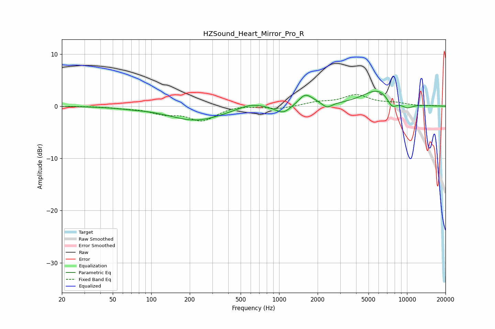

# HZSound_Heart_Mirror_Pro_R
See [usage instructions](https://github.com/jaakkopasanen/AutoEq#usage) for more options and info.

### Parametric EQs
Apply preamp of -3.0 dB when using parametric equalizer.

|   # | Type    |   Fc (Hz) |    Q |   Gain (dB) |
|-----|---------|-----------|------|-------------|
|   1 | Peaking |        68 | 1.24 |        -0.2 |
|   2 | Peaking |       224 | 0.68 |        -2.7 |
|   3 | Peaking |       600 | 1.46 |         1   |
|   4 | Peaking |      1075 | 2.44 |        -1.5 |
|   5 | Peaking |      1591 | 2.75 |         2   |
|   6 | Peaking |      1865 | 2.32 |         0.5 |
|   7 | Peaking |      2367 | 3.83 |        -1   |
|   8 | Peaking |      5998 | 1.08 |         3.3 |
|   9 | Peaking |      7636 | 3.3  |        -2.1 |
|  10 | Peaking |     10000 | 2.44 |        -1   |

### Fixed Band EQs
When using fixed band (also called graphic) equalizer, apply preamp of **-2.3 dB** (if available) and set gains manually with these parameters.

|   # | Type    |   Fc (Hz) |    Q |   Gain (dB) |
|-----|---------|-----------|------|-------------|
|   1 | Peaking |        31 | 1.41 |         0   |
|   2 | Peaking |        62 | 1.41 |        -0.3 |
|   3 | Peaking |       125 | 1.41 |        -1.2 |
|   4 | Peaking |       250 | 1.41 |        -2.6 |
|   5 | Peaking |       500 | 1.41 |         0.3 |
|   6 | Peaking |      1000 | 1.41 |        -0.5 |
|   7 | Peaking |      2000 | 1.41 |         0.7 |
|   8 | Peaking |      4000 | 1.41 |         2   |
|   9 | Peaking |      8000 | 1.41 |         0.5 |
|  10 | Peaking |     16000 | 1.41 |         0.1 |

### Graphs

