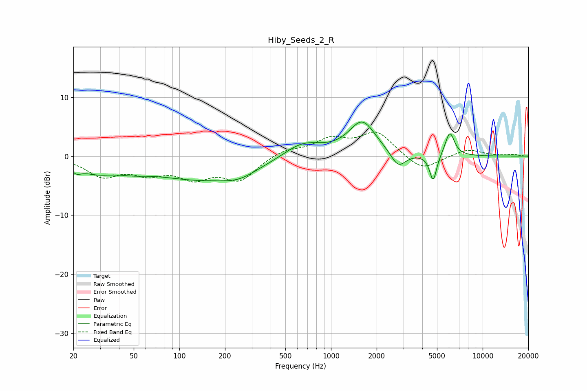

# Hiby_Seeds_2_R
See [usage instructions](https://github.com/jaakkopasanen/AutoEq#usage) for more options and info.

### Parametric EQs
Apply preamp of -5.9 dB when using parametric equalizer.

|   # | Type    |   Fc (Hz) |    Q |   Gain (dB) |
|-----|---------|-----------|------|-------------|
|   1 | Peaking |        21 | 4.53 |        -1.1 |
|   2 | Peaking |        28 | 1.13 |        -2   |
|   3 | Peaking |        49 | 1.38 |        -0.8 |
|   4 | Peaking |       138 | 0.42 |        -3.8 |
|   5 | Peaking |       248 | 1.28 |        -1.3 |
|   6 | Peaking |       650 | 1.13 |         2.6 |
|   7 | Peaking |      1608 | 1.58 |         5.8 |
|   8 | Peaking |      2774 | 2.9  |        -2.7 |
|   9 | Peaking |      4718 | 6    |        -4.6 |
|  10 | Peaking |      6072 | 4.52 |         4.1 |

### Fixed Band EQs
When using fixed band (also called graphic) equalizer, apply preamp of **-4.2 dB** (if available) and set gains manually with these parameters.

|   # | Type    |   Fc (Hz) |    Q |   Gain (dB) |
|-----|---------|-----------|------|-------------|
|   1 | Peaking |        31 | 1.41 |        -3.1 |
|   2 | Peaking |        62 | 1.41 |        -2.4 |
|   3 | Peaking |       125 | 1.41 |        -3.2 |
|   4 | Peaking |       250 | 1.41 |        -3.8 |
|   5 | Peaking |       500 | 1.41 |         1.1 |
|   6 | Peaking |      1000 | 1.41 |         2.6 |
|   7 | Peaking |      2000 | 1.41 |         4   |
|   8 | Peaking |      4000 | 1.41 |        -2.6 |
|   9 | Peaking |      8000 | 1.41 |         1.2 |
|  10 | Peaking |     16000 | 1.41 |         0.3 |

### Graphs

