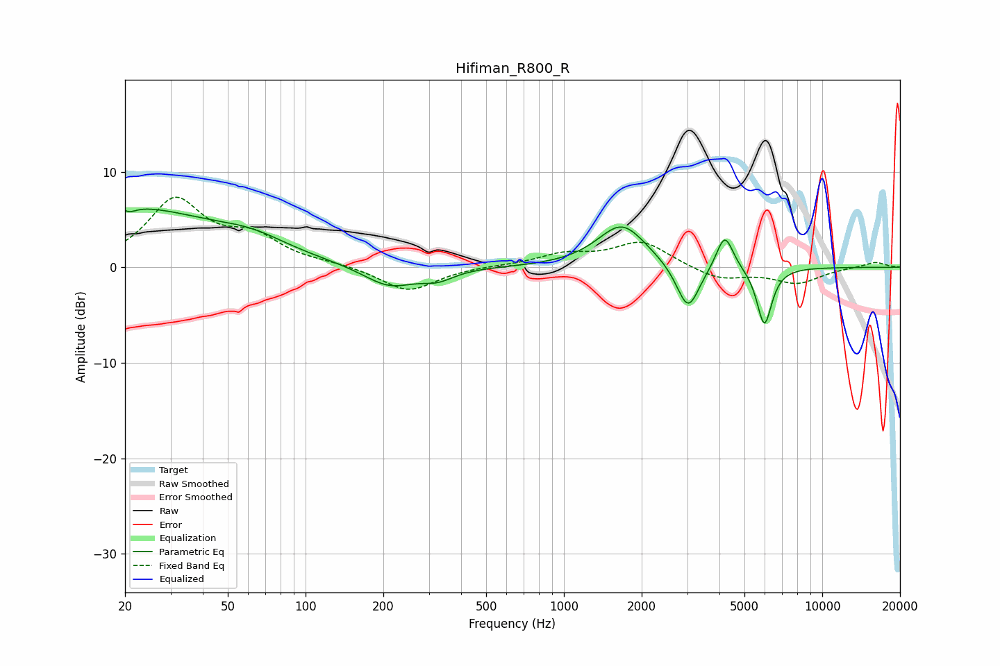

# Hifiman_R800_R
See [usage instructions](https://github.com/jaakkopasanen/AutoEq#usage) for more options and info.

### Parametric EQs
Apply preamp of -6.2 dB when using parametric equalizer.

|   # | Type    |   Fc (Hz) |    Q |   Gain (dB) |
|-----|---------|-----------|------|-------------|
|   1 | Peaking |        20 | 0.41 |         6.1 |
|   2 | Peaking |        21 | 5.9  |         3.2 |
|   3 | Peaking |        21 | 5.87 |        -3.7 |
|   4 | Peaking |        62 | 1.01 |         1.4 |
|   5 | Peaking |       211 | 1.41 |        -2.2 |
|   6 | Peaking |       325 | 2.2  |        -1   |
|   7 | Peaking |      1677 | 1.51 |         4.5 |
|   8 | Peaking |      3023 | 3.16 |        -5   |
|   9 | Peaking |      4194 | 4.31 |         3.8 |
|  10 | Peaking |      5970 | 4.76 |        -6.1 |

### Fixed Band EQs
When using fixed band (also called graphic) equalizer, apply preamp of **-7.4 dB** (if available) and set gains manually with these parameters.

|   # | Type    |   Fc (Hz) |    Q |   Gain (dB) |
|-----|---------|-----------|------|-------------|
|   1 | Peaking |        31 | 1.41 |         6.8 |
|   2 | Peaking |        62 | 1.41 |         2.7 |
|   3 | Peaking |       125 | 1.41 |         0.3 |
|   4 | Peaking |       250 | 1.41 |        -2.6 |
|   5 | Peaking |       500 | 1.41 |         0.1 |
|   6 | Peaking |      1000 | 1.41 |         1.2 |
|   7 | Peaking |      2000 | 1.41 |         2.7 |
|   8 | Peaking |      4000 | 1.41 |        -1.3 |
|   9 | Peaking |      8000 | 1.41 |        -1.6 |
|  10 | Peaking |     16000 | 1.41 |         0.6 |

### Graphs

