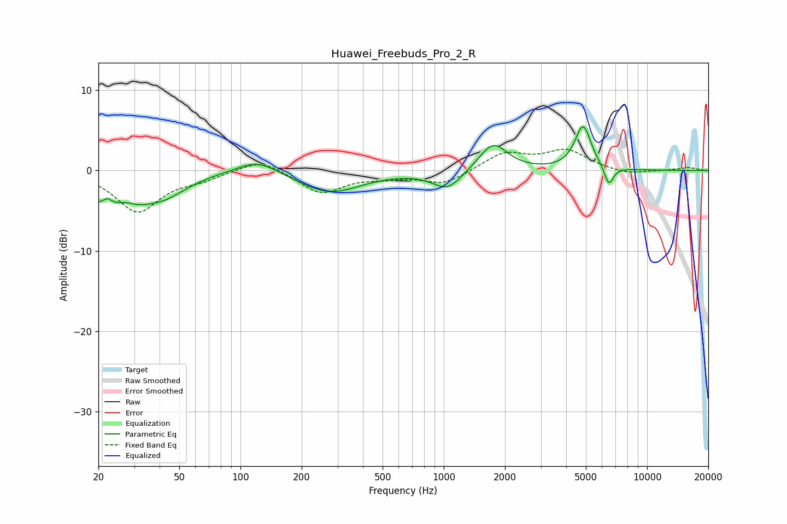

# Huawei_Freebuds_Pro_2_R
See [usage instructions](https://github.com/jaakkopasanen/AutoEq#usage) for more options and info.

### Parametric EQs
Apply preamp of -5.6 dB when using parametric equalizer.

|   # | Type    |   Fc (Hz) |    Q |   Gain (dB) |
|-----|---------|-----------|------|-------------|
|   1 | Peaking |        21 | 2.05 |        -4.1 |
|   2 | Peaking |        22 | 5.25 |         1.7 |
|   3 | Peaking |        32 | 2.35 |        -1.1 |
|   4 | Peaking |        41 | 1.19 |        -3   |
|   5 | Peaking |       122 | 1.36 |         1.8 |
|   6 | Peaking |       274 | 0.92 |        -2.8 |
|   7 | Peaking |      1042 | 1.94 |        -2.4 |
|   8 | Peaking |      1749 | 2.01 |         3.5 |
|   9 | Peaking |      4842 | 3.49 |         5.5 |
|  10 | Peaking |      6481 | 6    |        -2.4 |

### Fixed Band EQs
When using fixed band (also called graphic) equalizer, apply preamp of **-2.8 dB** (if available) and set gains manually with these parameters.

|   # | Type    |   Fc (Hz) |    Q |   Gain (dB) |
|-----|---------|-----------|------|-------------|
|   1 | Peaking |        31 | 1.41 |        -5   |
|   2 | Peaking |        62 | 1.41 |        -0.9 |
|   3 | Peaking |       125 | 1.41 |         1.6 |
|   4 | Peaking |       250 | 1.41 |        -2.8 |
|   5 | Peaking |       500 | 1.41 |        -0.6 |
|   6 | Peaking |      1000 | 1.41 |        -1.7 |
|   7 | Peaking |      2000 | 1.41 |         2.2 |
|   8 | Peaking |      4000 | 1.41 |         2.4 |
|   9 | Peaking |      8000 | 1.41 |        -0.5 |
|  10 | Peaking |     16000 | 1.41 |         0.4 |

### Graphs

