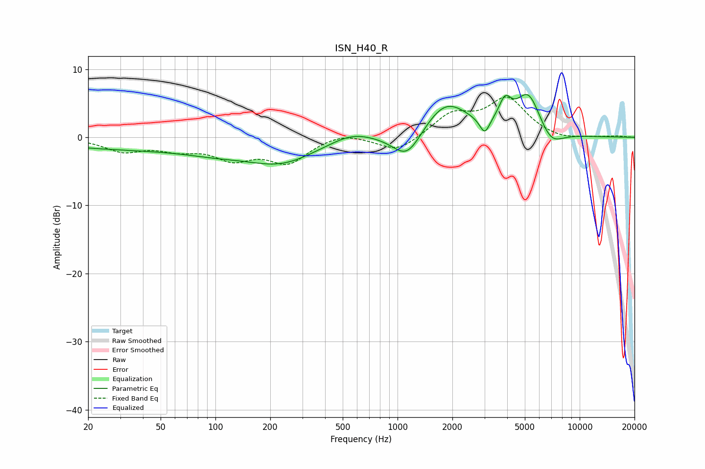

# ISN_H40_R
See [usage instructions](https://github.com/jaakkopasanen/AutoEq#usage) for more options and info.

### Parametric EQs
Apply preamp of -6.4 dB when using parametric equalizer.

|   # | Type    |   Fc (Hz) |    Q |   Gain (dB) |
|-----|---------|-----------|------|-------------|
|   1 | Peaking |        41 | 0.25 |        -1.7 |
|   2 | Peaking |       100 | 0.88 |        -0.7 |
|   3 | Peaking |       232 | 0.74 |        -3.2 |
|   4 | Peaking |       559 | 1.21 |         1.3 |
|   5 | Peaking |      1130 | 1.74 |        -4.3 |
|   6 | Peaking |      1838 | 1.13 |         5.3 |
|   7 | Peaking |      3010 | 5.26 |        -2.4 |
|   8 | Peaking |      3893 | 4.1  |         3.3 |
|   9 | Peaking |      5232 | 2.01 |         6.2 |
|  10 | Peaking |      6935 | 2.08 |        -2.5 |

### Fixed Band EQs
When using fixed band (also called graphic) equalizer, apply preamp of **-6.0 dB** (if available) and set gains manually with these parameters.

|   # | Type    |   Fc (Hz) |    Q |   Gain (dB) |
|-----|---------|-----------|------|-------------|
|   1 | Peaking |        31 | 1.41 |        -1.9 |
|   2 | Peaking |        62 | 1.41 |        -1.5 |
|   3 | Peaking |       125 | 1.41 |        -2.8 |
|   4 | Peaking |       250 | 1.41 |        -3.5 |
|   5 | Peaking |       500 | 1.41 |         0.9 |
|   6 | Peaking |      1000 | 1.41 |        -2.2 |
|   7 | Peaking |      2000 | 1.41 |         3.2 |
|   8 | Peaking |      4000 | 1.41 |         5.5 |
|   9 | Peaking |      8000 | 1.41 |        -0.5 |
|  10 | Peaking |     16000 | 1.41 |         0.2 |

### Graphs

