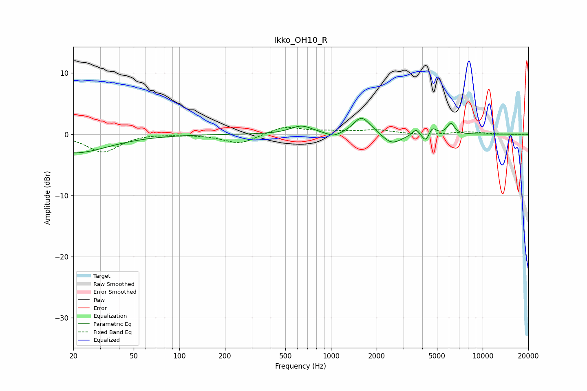

# Ikko_OH10_R
See [usage instructions](https://github.com/jaakkopasanen/AutoEq#usage) for more options and info.

### Parametric EQs
Apply preamp of -2.7 dB when using parametric equalizer.

|   # | Type    |   Fc (Hz) |    Q |   Gain (dB) |
|-----|---------|-----------|------|-------------|
|   1 | Peaking |        20 | 0.63 |        -3.1 |
|   2 | Peaking |       637 | 2    |         1.3 |
|   3 | Peaking |      1040 | 3.09 |        -0.7 |
|   4 | Peaking |      1578 | 2.8  |         2.5 |
|   5 | Peaking |      1801 | 2.24 |         0.5 |
|   6 | Peaking |      2521 | 2.28 |        -1.8 |
|   7 | Peaking |      3643 | 6    |         1.1 |
|   8 | Peaking |      4212 | 5.81 |        -1.5 |
|   9 | Peaking |      4659 | 6    |         1.3 |
|  10 | Peaking |      6172 | 5.85 |         1.8 |

### Fixed Band EQs
When using fixed band (also called graphic) equalizer, apply preamp of **-1.2 dB** (if available) and set gains manually with these parameters.

|   # | Type    |   Fc (Hz) |    Q |   Gain (dB) |
|-----|---------|-----------|------|-------------|
|   1 | Peaking |        31 | 1.41 |        -2.9 |
|   2 | Peaking |        62 | 1.41 |         0.1 |
|   3 | Peaking |       125 | 1.41 |        -0   |
|   4 | Peaking |       250 | 1.41 |        -1.6 |
|   5 | Peaking |       500 | 1.41 |         1.3 |
|   6 | Peaking |      1000 | 1.41 |         0.4 |
|   7 | Peaking |      2000 | 1.41 |         0.7 |
|   8 | Peaking |      4000 | 1.41 |        -0.2 |
|   9 | Peaking |      8000 | 1.41 |         0.4 |
|  10 | Peaking |     16000 | 1.41 |        -0   |

### Graphs

