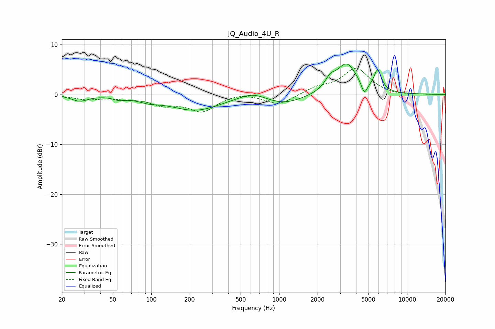

# JQ_Audio_4U_R
See [usage instructions](https://github.com/jaakkopasanen/AutoEq#usage) for more options and info.

### Parametric EQs
Apply preamp of -6.2 dB when using parametric equalizer.

|   # | Type    |   Fc (Hz) |    Q |   Gain (dB) |
|-----|---------|-----------|------|-------------|
|   1 | Peaking |        28 | 2.25 |        -1.2 |
|   2 | Peaking |        56 | 3.24 |        -0.6 |
|   3 | Peaking |        96 | 1.61 |        -0.8 |
|   4 | Peaking |       221 | 0.73 |        -3.1 |
|   5 | Peaking |       623 | 1.36 |         1.4 |
|   6 | Peaking |      1085 | 0.91 |        -1.9 |
|   7 | Peaking |      2511 | 3.51 |         1.9 |
|   8 | Peaking |      3373 | 1.74 |         6   |
|   9 | Peaking |      4635 | 6    |        -2.5 |
|  10 | Peaking |      5903 | 4.69 |         4.1 |

### Fixed Band EQs
When using fixed band (also called graphic) equalizer, apply preamp of **-5.3 dB** (if available) and set gains manually with these parameters.

|   # | Type    |   Fc (Hz) |    Q |   Gain (dB) |
|-----|---------|-----------|------|-------------|
|   1 | Peaking |        31 | 1.41 |        -0.9 |
|   2 | Peaking |        62 | 1.41 |        -0.6 |
|   3 | Peaking |       125 | 1.41 |        -1.8 |
|   4 | Peaking |       250 | 1.41 |        -3.2 |
|   5 | Peaking |       500 | 1.41 |         0.5 |
|   6 | Peaking |      1000 | 1.41 |        -2.1 |
|   7 | Peaking |      2000 | 1.41 |         1.2 |
|   8 | Peaking |      4000 | 1.41 |         5.1 |
|   9 | Peaking |      8000 | 1.41 |        -0.3 |
|  10 | Peaking |     16000 | 1.41 |         0   |

### Graphs

