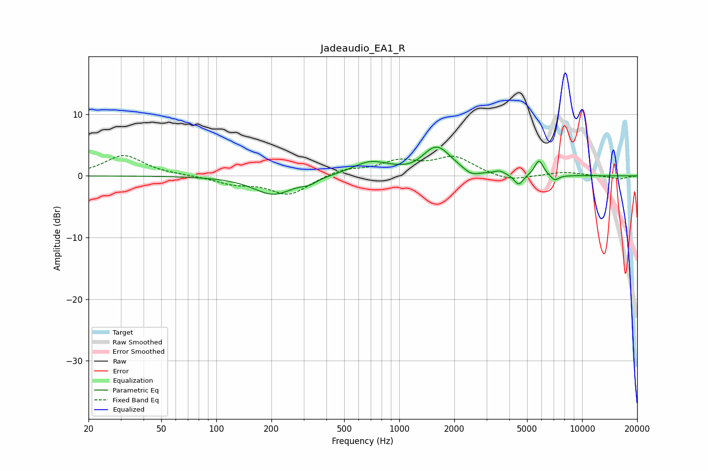

# Jadeaudio_EA1_R
See [usage instructions](https://github.com/jaakkopasanen/AutoEq#usage) for more options and info.

### Parametric EQs
Apply preamp of -4.8 dB when using parametric equalizer.

|   # | Type    |   Fc (Hz) |    Q |   Gain (dB) |
|-----|---------|-----------|------|-------------|
|   1 | Peaking |       206 | 1.3  |        -3   |
|   2 | Peaking |       322 | 3.65 |        -0.7 |
|   3 | Peaking |       694 | 1.42 |         2.2 |
|   4 | Peaking |      1187 | 2.58 |        -0.4 |
|   5 | Peaking |      1602 | 1.78 |         4.6 |
|   6 | Peaking |      2477 | 3.44 |        -0.9 |
|   7 | Peaking |      3535 | 4.87 |         0.6 |
|   8 | Peaking |      4502 | 5.61 |        -1.8 |
|   9 | Peaking |      5810 | 5.91 |         2.5 |
|  10 | Peaking |      7089 | 6    |        -0.9 |

### Fixed Band EQs
When using fixed band (also called graphic) equalizer, apply preamp of **-3.4 dB** (if available) and set gains manually with these parameters.

|   # | Type    |   Fc (Hz) |    Q |   Gain (dB) |
|-----|---------|-----------|------|-------------|
|   1 | Peaking |        31 | 1.41 |         3.3 |
|   2 | Peaking |        62 | 1.41 |         0.1 |
|   3 | Peaking |       125 | 1.41 |        -1.2 |
|   4 | Peaking |       250 | 1.41 |        -3.1 |
|   5 | Peaking |       500 | 1.41 |         1.1 |
|   6 | Peaking |      1000 | 1.41 |         2.1 |
|   7 | Peaking |      2000 | 1.41 |         2.9 |
|   8 | Peaking |      4000 | 1.41 |        -1   |
|   9 | Peaking |      8000 | 1.41 |         0.6 |
|  10 | Peaking |     16000 | 1.41 |        -0.5 |

### Graphs

