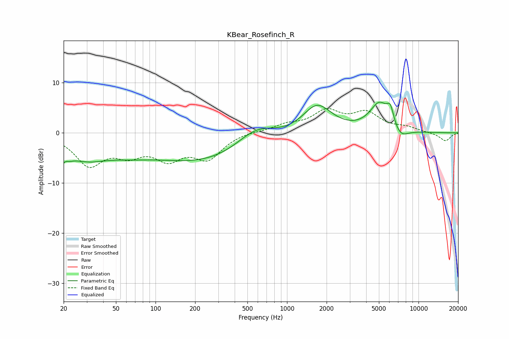

# KBear_Rosefinch_R
See [usage instructions](https://github.com/jaakkopasanen/AutoEq#usage) for more options and info.

### Parametric EQs
Apply preamp of -6.2 dB when using parametric equalizer.

|   # | Type    |   Fc (Hz) |    Q |   Gain (dB) |
|-----|---------|-----------|------|-------------|
|   1 | Peaking |        20 | 3.95 |        -5.5 |
|   2 | Peaking |        20 | 5.73 |         3.1 |
|   3 | Peaking |        30 | 0.83 |        -4.1 |
|   4 | Peaking |        62 | 0.85 |        -1.4 |
|   5 | Peaking |       268 | 0.28 |        -6.2 |
|   6 | Peaking |       583 | 0.86 |         4.9 |
|   7 | Peaking |      1693 | 1.23 |         6   |
|   8 | Peaking |      5048 | 1.88 |         5.6 |
|   9 | Peaking |      6109 | 5.15 |         3.1 |
|  10 | Peaking |      7255 | 2.28 |        -2.1 |

### Fixed Band EQs
When using fixed band (also called graphic) equalizer, apply preamp of **-4.9 dB** (if available) and set gains manually with these parameters.

|   # | Type    |   Fc (Hz) |    Q |   Gain (dB) |
|-----|---------|-----------|------|-------------|
|   1 | Peaking |        31 | 1.41 |        -6.1 |
|   2 | Peaking |        62 | 1.41 |        -3.4 |
|   3 | Peaking |       125 | 1.41 |        -4.4 |
|   4 | Peaking |       250 | 1.41 |        -4.7 |
|   5 | Peaking |       500 | 1.41 |         0.3 |
|   6 | Peaking |      1000 | 1.41 |         1.4 |
|   7 | Peaking |      2000 | 1.41 |         4   |
|   8 | Peaking |      4000 | 1.41 |         3.6 |
|   9 | Peaking |      8000 | 1.41 |         0.9 |
|  10 | Peaking |     16000 | 1.41 |        -1.7 |

### Graphs

