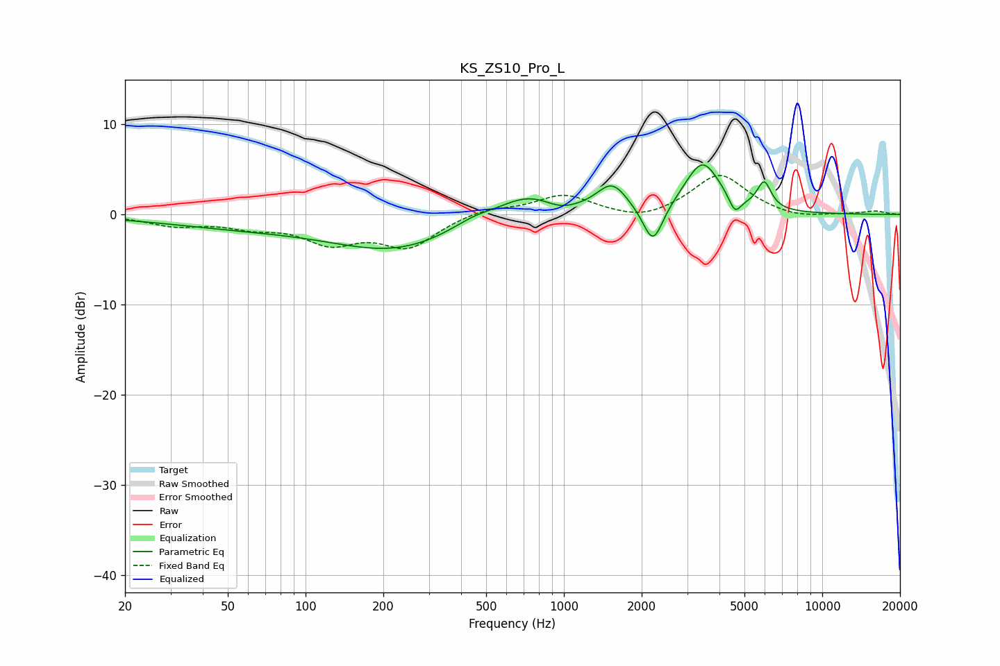

# KS_ZS10_Pro_L
See [usage instructions](https://github.com/jaakkopasanen/AutoEq#usage) for more options and info.

### Parametric EQs
Apply preamp of -5.6 dB when using parametric equalizer.

|   # | Type    |   Fc (Hz) |    Q |   Gain (dB) |
|-----|---------|-----------|------|-------------|
|   1 | Peaking |        56 | 0.44 |        -1.2 |
|   2 | Peaking |       224 | 0.56 |        -3.7 |
|   3 | Peaking |       444 | 1.64 |         0.9 |
|   4 | Peaking |       726 | 1.16 |         2.6 |
|   5 | Peaking |       967 | 2.24 |        -0.8 |
|   6 | Peaking |      1536 | 2.38 |         3.1 |
|   7 | Peaking |      2212 | 3.65 |        -4.5 |
|   8 | Peaking |      3439 | 2.04 |         5.7 |
|   9 | Peaking |      4594 | 5.98 |        -1.9 |
|  10 | Peaking |      5960 | 5.14 |         3   |

### Fixed Band EQs
When using fixed band (also called graphic) equalizer, apply preamp of **-4.4 dB** (if available) and set gains manually with these parameters.

|   # | Type    |   Fc (Hz) |    Q |   Gain (dB) |
|-----|---------|-----------|------|-------------|
|   1 | Peaking |        31 | 1.41 |        -1.1 |
|   2 | Peaking |        62 | 1.41 |        -1.1 |
|   3 | Peaking |       125 | 1.41 |        -2.8 |
|   4 | Peaking |       250 | 1.41 |        -3.4 |
|   5 | Peaking |       500 | 1.41 |         0.7 |
|   6 | Peaking |      1000 | 1.41 |         2.1 |
|   7 | Peaking |      2000 | 1.41 |        -0.9 |
|   8 | Peaking |      4000 | 1.41 |         4.5 |
|   9 | Peaking |      8000 | 1.41 |        -0.5 |
|  10 | Peaking |     16000 | 1.41 |         0.4 |

### Graphs

