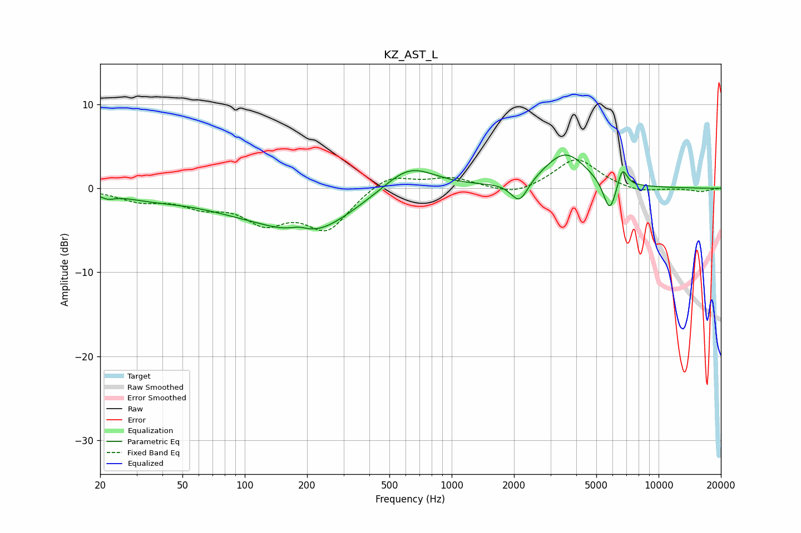

# KZ_AST_L
See [usage instructions](https://github.com/jaakkopasanen/AutoEq#usage) for more options and info.

### Parametric EQs
Apply preamp of -4.1 dB when using parametric equalizer.

|   # | Type    |   Fc (Hz) |    Q |   Gain (dB) |
|-----|---------|-----------|------|-------------|
|   1 | Peaking |        22 | 4.37 |        -0.5 |
|   2 | Peaking |        35 | 0.87 |        -0.8 |
|   3 | Peaking |        93 | 0.6  |        -1.6 |
|   4 | Peaking |       183 | 2.92 |         0.7 |
|   5 | Peaking |       209 | 0.7  |        -4.8 |
|   6 | Peaking |       623 | 1.14 |         3.2 |
|   7 | Peaking |      2124 | 3.44 |        -2.7 |
|   8 | Peaking |      3541 | 1.35 |         4.2 |
|   9 | Peaking |      5806 | 4.51 |        -3.9 |
|  10 | Peaking |      6679 | 6    |         2.4 |

### Fixed Band EQs
When using fixed band (also called graphic) equalizer, apply preamp of **-3.5 dB** (if available) and set gains manually with these parameters.

|   # | Type    |   Fc (Hz) |    Q |   Gain (dB) |
|-----|---------|-----------|------|-------------|
|   1 | Peaking |        31 | 1.41 |        -1.3 |
|   2 | Peaking |        62 | 1.41 |        -1.7 |
|   3 | Peaking |       125 | 1.41 |        -3.5 |
|   4 | Peaking |       250 | 1.41 |        -4.7 |
|   5 | Peaking |       500 | 1.41 |         1.8 |
|   6 | Peaking |      1000 | 1.41 |         1.2 |
|   7 | Peaking |      2000 | 1.41 |        -1   |
|   8 | Peaking |      4000 | 1.41 |         3.6 |
|   9 | Peaking |      8000 | 1.41 |        -0.6 |
|  10 | Peaking |     16000 | 1.41 |        -0.4 |

### Graphs

