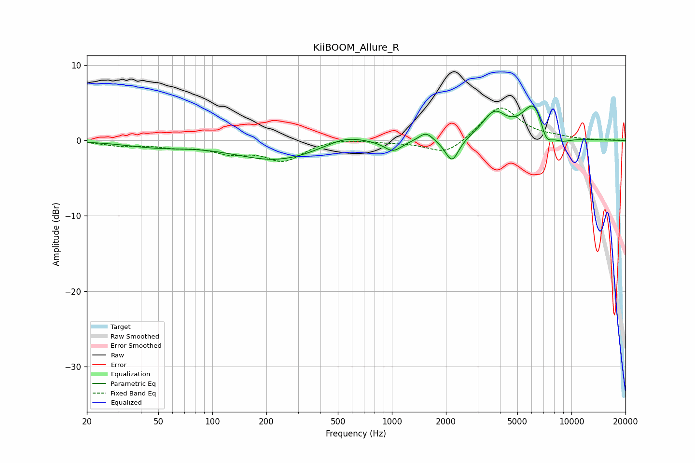

# KiiBOOM_Allure_R
See [usage instructions](https://github.com/jaakkopasanen/AutoEq#usage) for more options and info.

### Parametric EQs
Apply preamp of -4.7 dB when using parametric equalizer.

|   # | Type    |   Fc (Hz) |    Q |   Gain (dB) |
|-----|---------|-----------|------|-------------|
|   1 | Peaking |        48 | 0.8  |        -0.7 |
|   2 | Peaking |       230 | 0.59 |        -2.6 |
|   3 | Peaking |       546 | 1.22 |         1.3 |
|   4 | Peaking |      1013 | 2.92 |        -1.4 |
|   5 | Peaking |      1545 | 3.67 |         1.2 |
|   6 | Peaking |      2163 | 3.72 |        -3.2 |
|   7 | Peaking |      3716 | 2.16 |         3.3 |
|   8 | Peaking |      6263 | 2.04 |         5.3 |
|   9 | Peaking |      7203 | 3.62 |        -3   |
|  10 | Peaking |      8773 | 2.22 |        -0.9 |

### Fixed Band EQs
When using fixed band (also called graphic) equalizer, apply preamp of **-4.4 dB** (if available) and set gains manually with these parameters.

|   # | Type    |   Fc (Hz) |    Q |   Gain (dB) |
|-----|---------|-----------|------|-------------|
|   1 | Peaking |        31 | 1.41 |        -0.6 |
|   2 | Peaking |        62 | 1.41 |        -0.7 |
|   3 | Peaking |       125 | 1.41 |        -1.4 |
|   4 | Peaking |       250 | 1.41 |        -2.6 |
|   5 | Peaking |       500 | 1.41 |         0.4 |
|   6 | Peaking |      1000 | 1.41 |        -0.2 |
|   7 | Peaking |      2000 | 1.41 |        -2   |
|   8 | Peaking |      4000 | 1.41 |         4.6 |
|   9 | Peaking |      8000 | 1.41 |         0.3 |
|  10 | Peaking |     16000 | 1.41 |         0   |

### Graphs

