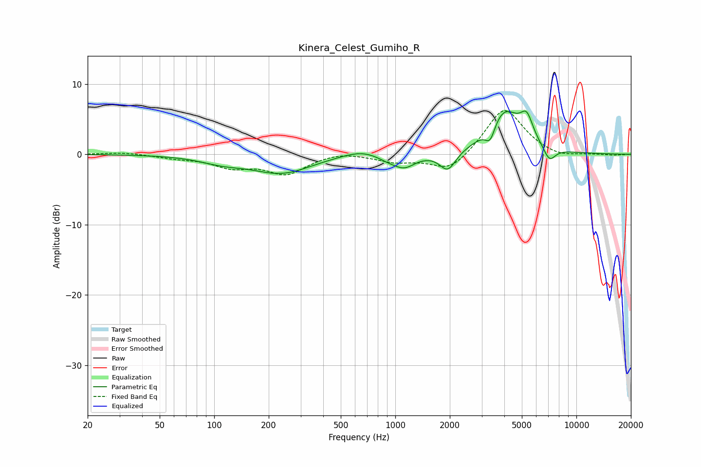

# Kinera_Celest_Gumiho_R
See [usage instructions](https://github.com/jaakkopasanen/AutoEq#usage) for more options and info.

### Parametric EQs
Apply preamp of -6.2 dB when using parametric equalizer.

|   # | Type    |   Fc (Hz) |    Q |   Gain (dB) |
|-----|---------|-----------|------|-------------|
|   1 | Peaking |       111 | 1.16 |        -0.9 |
|   2 | Peaking |       236 | 0.86 |        -2.6 |
|   3 | Peaking |       657 | 1.28 |         1   |
|   4 | Peaking |       913 | 2.13 |        -0.7 |
|   5 | Peaking |      1125 | 2.34 |        -1.7 |
|   6 | Peaking |      1949 | 3.18 |        -2.7 |
|   7 | Peaking |      3344 | 5.19 |        -2.4 |
|   8 | Peaking |      3980 | 1.53 |         6.2 |
|   9 | Peaking |      5322 | 3.97 |         3.2 |
|  10 | Peaking |      7095 | 4    |        -2.1 |

### Fixed Band EQs
When using fixed band (also called graphic) equalizer, apply preamp of **-6.3 dB** (if available) and set gains manually with these parameters.

|   # | Type    |   Fc (Hz) |    Q |   Gain (dB) |
|-----|---------|-----------|------|-------------|
|   1 | Peaking |        31 | 1.41 |         0.3 |
|   2 | Peaking |        62 | 1.41 |        -0.4 |
|   3 | Peaking |       125 | 1.41 |        -1.6 |
|   4 | Peaking |       250 | 1.41 |        -2.7 |
|   5 | Peaking |       500 | 1.41 |         0.5 |
|   6 | Peaking |      1000 | 1.41 |        -1   |
|   7 | Peaking |      2000 | 1.41 |        -2.6 |
|   8 | Peaking |      4000 | 1.41 |         6.8 |
|   9 | Peaking |      8000 | 1.41 |        -0.7 |
|  10 | Peaking |     16000 | 1.41 |        -0.1 |

### Graphs

