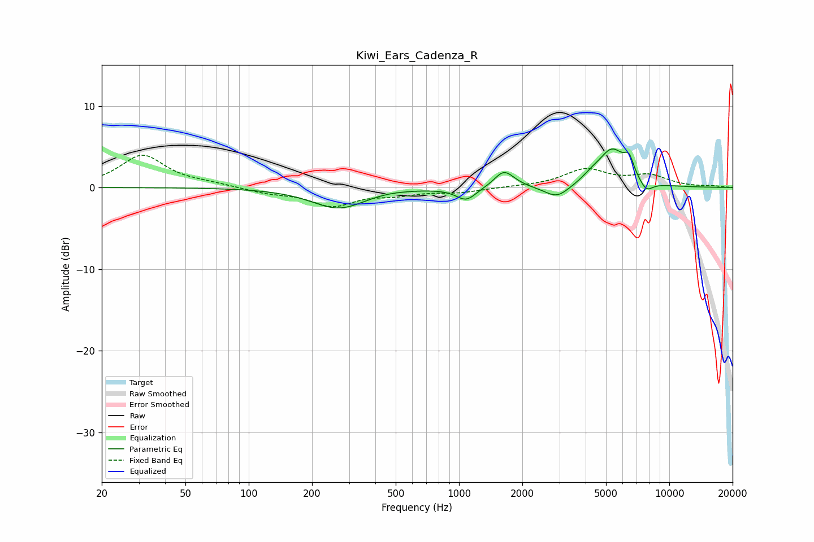

# Kiwi_Ears_Cadenza_R
See [usage instructions](https://github.com/jaakkopasanen/AutoEq#usage) for more options and info.

### Parametric EQs
Apply preamp of -4.8 dB when using parametric equalizer.

|   # | Type    |   Fc (Hz) |    Q |   Gain (dB) |
|-----|---------|-----------|------|-------------|
|   1 | Peaking |       268 | 1.1  |        -2.5 |
|   2 | Peaking |       451 | 1.51 |         0.2 |
|   3 | Peaking |      1082 | 2.96 |        -1.6 |
|   4 | Peaking |      1625 | 3.22 |         1.7 |
|   5 | Peaking |      1726 | 2.6  |         0.5 |
|   6 | Peaking |      2926 | 2.37 |        -1.6 |
|   7 | Peaking |      4272 | 3.04 |         0.6 |
|   8 | Peaking |      5347 | 2.11 |         4.5 |
|   9 | Peaking |      6432 | 6    |         2   |
|  10 | Peaking |      7769 | 4.17 |        -1.3 |

### Fixed Band EQs
When using fixed band (also called graphic) equalizer, apply preamp of **-4.0 dB** (if available) and set gains manually with these parameters.

|   # | Type    |   Fc (Hz) |    Q |   Gain (dB) |
|-----|---------|-----------|------|-------------|
|   1 | Peaking |        31 | 1.41 |         3.9 |
|   2 | Peaking |        62 | 1.41 |         0.4 |
|   3 | Peaking |       125 | 1.41 |        -0.6 |
|   4 | Peaking |       250 | 1.41 |        -2.1 |
|   5 | Peaking |       500 | 1.41 |        -0.7 |
|   6 | Peaking |      1000 | 1.41 |        -0.5 |
|   7 | Peaking |      2000 | 1.41 |         0.1 |
|   8 | Peaking |      4000 | 1.41 |         2.1 |
|   9 | Peaking |      8000 | 1.41 |         1.3 |
|  10 | Peaking |     16000 | 1.41 |         0.2 |

### Graphs

