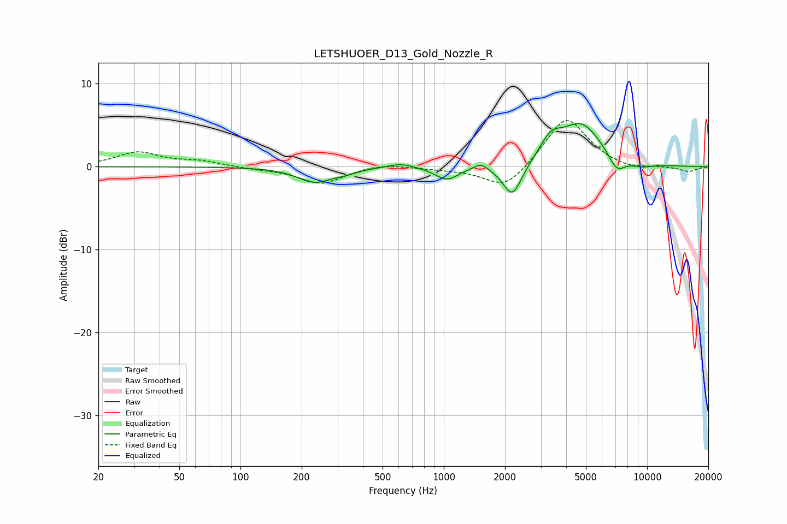

# LETSHUOER_D13_Gold_Nozzle_R
See [usage instructions](https://github.com/jaakkopasanen/AutoEq#usage) for more options and info.

### Parametric EQs
Apply preamp of -5.3 dB when using parametric equalizer.

|   # | Type    |   Fc (Hz) |    Q |   Gain (dB) |
|-----|---------|-----------|------|-------------|
|   1 | Peaking |       231 | 1.67 |        -1.8 |
|   2 | Peaking |       327 | 2.43 |        -0.4 |
|   3 | Peaking |       615 | 2.24 |         0.6 |
|   4 | Peaking |      1034 | 2.49 |        -1.6 |
|   5 | Peaking |      1522 | 4.28 |         0.8 |
|   6 | Peaking |      2175 | 2.97 |        -4.1 |
|   7 | Peaking |      3363 | 2.73 |         2.3 |
|   8 | Peaking |      4740 | 1.32 |         5.1 |
|   9 | Peaking |      7092 | 3.17 |        -2   |
|  10 | Peaking |      9397 | 2.31 |        -0.5 |

### Fixed Band EQs
When using fixed band (also called graphic) equalizer, apply preamp of **-5.7 dB** (if available) and set gains manually with these parameters.

|   # | Type    |   Fc (Hz) |    Q |   Gain (dB) |
|-----|---------|-----------|------|-------------|
|   1 | Peaking |        31 | 1.41 |         1.7 |
|   2 | Peaking |        62 | 1.41 |         0.6 |
|   3 | Peaking |       125 | 1.41 |        -0.2 |
|   4 | Peaking |       250 | 1.41 |        -2   |
|   5 | Peaking |       500 | 1.41 |         0.4 |
|   6 | Peaking |      1000 | 1.41 |        -0.2 |
|   7 | Peaking |      2000 | 1.41 |        -2.9 |
|   8 | Peaking |      4000 | 1.41 |         6.1 |
|   9 | Peaking |      8000 | 1.41 |        -0.5 |
|  10 | Peaking |     16000 | 1.41 |        -0.6 |

### Graphs

