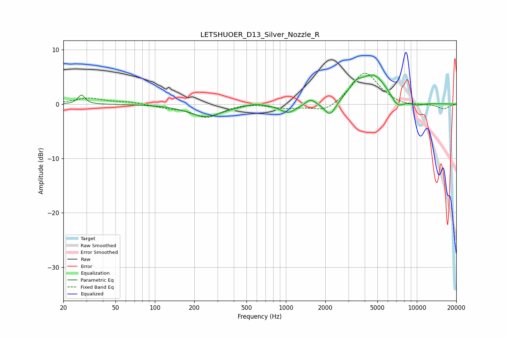

# LETSHUOER_D13_Silver_Nozzle_R
See [usage instructions](https://github.com/jaakkopasanen/AutoEq#usage) for more options and info.

### Parametric EQs
Apply preamp of -5.5 dB when using parametric equalizer.

|   # | Type    |   Fc (Hz) |    Q |   Gain (dB) |
|-----|---------|-----------|------|-------------|
|   1 | Peaking |        28 | 5.53 |         1.7 |
|   2 | Peaking |       243 | 1.14 |        -2.3 |
|   3 | Peaking |       583 | 2.38 |         0.4 |
|   4 | Peaking |      1043 | 2.35 |        -1.6 |
|   5 | Peaking |      1545 | 4.01 |         1.1 |
|   6 | Peaking |      2176 | 3.35 |        -2.7 |
|   7 | Peaking |      3400 | 2.74 |         1.9 |
|   8 | Peaking |      4676 | 1.34 |         5.2 |
|   9 | Peaking |      7115 | 2.83 |        -1.9 |
|  10 | Peaking |     10000 | 2.3  |        -0.5 |

### Fixed Band EQs
When using fixed band (also called graphic) equalizer, apply preamp of **-5.8 dB** (if available) and set gains manually with these parameters.

|   # | Type    |   Fc (Hz) |    Q |   Gain (dB) |
|-----|---------|-----------|------|-------------|
|   1 | Peaking |        31 | 1.41 |         1.1 |
|   2 | Peaking |        62 | 1.41 |         0.4 |
|   3 | Peaking |       125 | 1.41 |        -0.5 |
|   4 | Peaking |       250 | 1.41 |        -2.4 |
|   5 | Peaking |       500 | 1.41 |         0.3 |
|   6 | Peaking |      1000 | 1.41 |        -0.7 |
|   7 | Peaking |      2000 | 1.41 |        -1.6 |
|   8 | Peaking |      4000 | 1.41 |         6.1 |
|   9 | Peaking |      8000 | 1.41 |        -0.5 |
|  10 | Peaking |     16000 | 1.41 |        -0.9 |

### Graphs

