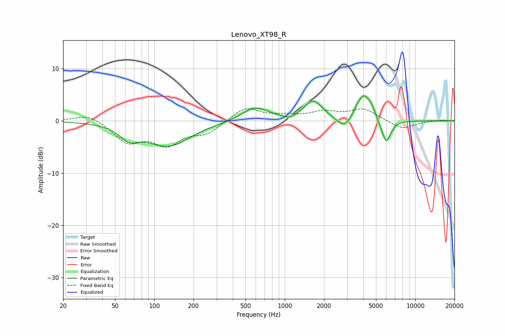

# Lenovo_XT98_R
See [usage instructions](https://github.com/jaakkopasanen/AutoEq#usage) for more options and info.

### Parametric EQs
Apply preamp of -4.9 dB when using parametric equalizer.

|   # | Type    |   Fc (Hz) |    Q |   Gain (dB) |
|-----|---------|-----------|------|-------------|
|   1 | Peaking |        64 | 2.06 |        -2.3 |
|   2 | Peaking |       128 | 0.82 |        -4.7 |
|   3 | Peaking |       592 | 1.4  |         2.7 |
|   4 | Peaking |      1093 | 3.06 |        -0.7 |
|   5 | Peaking |      1650 | 1.98 |         3.8 |
|   6 | Peaking |      2829 | 2.88 |        -2   |
|   7 | Peaking |      3593 | 5.99 |         0.9 |
|   8 | Peaking |      4043 | 3.15 |         4.5 |
|   9 | Peaking |      4630 | 5.1  |         1.5 |
|  10 | Peaking |      5992 | 3.97 |        -4.5 |

### Fixed Band EQs
When using fixed band (also called graphic) equalizer, apply preamp of **-2.4 dB** (if available) and set gains manually with these parameters.

|   # | Type    |   Fc (Hz) |    Q |   Gain (dB) |
|-----|---------|-----------|------|-------------|
|   1 | Peaking |        31 | 1.41 |         1.5 |
|   2 | Peaking |        62 | 1.41 |        -3.8 |
|   3 | Peaking |       125 | 1.41 |        -4.1 |
|   4 | Peaking |       250 | 1.41 |        -2.2 |
|   5 | Peaking |       500 | 1.41 |         2.7 |
|   6 | Peaking |      1000 | 1.41 |         0.7 |
|   7 | Peaking |      2000 | 1.41 |         1.5 |
|   8 | Peaking |      4000 | 1.41 |         2.2 |
|   9 | Peaking |      8000 | 1.41 |        -1.6 |
|  10 | Peaking |     16000 | 1.41 |         0.2 |

### Graphs

