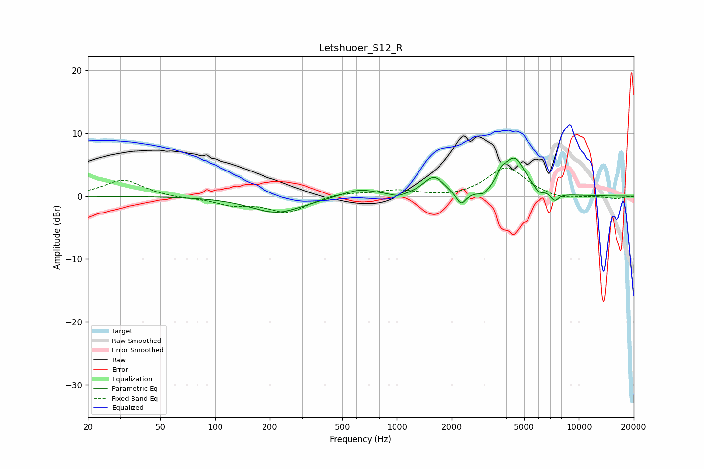

# Letshuoer_S12_R
See [usage instructions](https://github.com/jaakkopasanen/AutoEq#usage) for more options and info.

### Parametric EQs
Apply preamp of -6.2 dB when using parametric equalizer.

|   # | Type    |   Fc (Hz) |    Q |   Gain (dB) |
|-----|---------|-----------|------|-------------|
|   1 | Peaking |       218 | 0.99 |        -2.6 |
|   2 | Peaking |       619 | 1.49 |         1.2 |
|   3 | Peaking |      1016 | 3.37 |        -0.6 |
|   4 | Peaking |      1593 | 2.55 |         3   |
|   5 | Peaking |      2251 | 5.04 |        -2.2 |
|   6 | Peaking |      3013 | 4.4  |        -1   |
|   7 | Peaking |      3747 | 6    |         1.4 |
|   8 | Peaking |      4421 | 2.29 |         5.9 |
|   9 | Peaking |      6022 | 6    |        -0.9 |
|  10 | Peaking |      7377 | 6    |        -1.3 |

### Fixed Band EQs
When using fixed band (also called graphic) equalizer, apply preamp of **-4.6 dB** (if available) and set gains manually with these parameters.

|   # | Type    |   Fc (Hz) |    Q |   Gain (dB) |
|-----|---------|-----------|------|-------------|
|   1 | Peaking |        31 | 1.41 |         2.6 |
|   2 | Peaking |        62 | 1.41 |        -0.3 |
|   3 | Peaking |       125 | 1.41 |        -1.2 |
|   4 | Peaking |       250 | 1.41 |        -2.5 |
|   5 | Peaking |       500 | 1.41 |         0.6 |
|   6 | Peaking |      1000 | 1.41 |         0.9 |
|   7 | Peaking |      2000 | 1.41 |        -0.3 |
|   8 | Peaking |      4000 | 1.41 |         4.6 |
|   9 | Peaking |      8000 | 1.41 |        -0.7 |
|  10 | Peaking |     16000 | 1.41 |        -0.4 |

### Graphs

